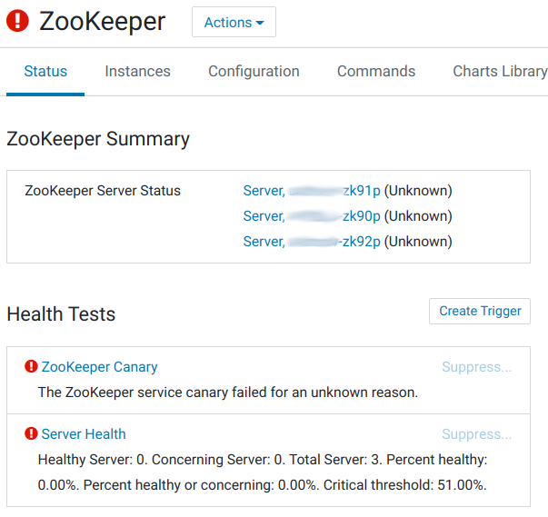

2021-07-09

## Настройка TLS для ZooKeeper
> Напомню, что перед включением TLS-настроек для Zookeeper'а должен быть включён TLS для «Firehose Debug Server» в Cloudera Manager. Иначе Zookeeper будет работать, но статус ролей перестаёт отображаться корректно и высвечивается ошибка "Quorum Membership".
    

1. В настройках сервиса ZooKeeper, используя фильтр по слову 'JMX', изменяем следующие параметры:
<table>
<tr>
<th>Property</th><th>Value</th><th>Description</th>
</tr>
<tr>
<td><b>Enable Authenticated Communication with the JMX Agent</b></td>
<td>☑</td>
<td>Enables authentication when interacting with the JMX agent on the ZooKeeper server.</td>
</tr>
<tr>
<td><b>Enable TLS/SSL for ZooKeeper JMX</b></td>
<td>☑</td>
<td>Encrypt communication between clients and ZooKeeper JMX using Transport Layer Security (TLS) (formerly known as Secure Socket Layer (SSL)).</td>
</tr>
<tr>
<td><b>ZooKeeper JMX TLS/SSL Server JKS Keystore File Location</b></td>
<td><code>/opt/cloudera/security/pki/server.jks</code></td>
<td>The path to the TLS/SSL keystore file containing the server certificate and private key used for TLS/SSL. Used when ZooKeeper JMX is acting as a TLS/SSL server. The keystore must be in JKS format.</td>
</tr>
<tr>
<td><b>ZooKeeper JMX TLS/SSL Server JKS Keystore File Password</b></td>
<td>По умолчанию: changeit.</td>
<td>The password for the ZooKeeper JMX JKS keystore file.</td>
</tr>
<tr>
<td><b>ZooKeeper JMX TLS/SSL Server Trust Store File</b></td>
<td><code>/usr/java/jdk1.8.0_181-cloudera/jre/lib/security/jssecacerts</code></td>
<td>The location on disk of the trust store, in .jks format, used to confirm the authenticity of TLS/SSL servers that ZooKeeper JMX might connect to. This is used when ZooKeeper JMX is the server in a TLS/SSL connection. This trust store must contain the certificate(s) used to sign the service(s) connected to. If this parameter is not provided, the default list of well-known certificate authorities is used instead.</td>
</tr>
<tr>
<td><b>ZooKeeper JMX TLS/SSL Server Trust Store Password</b></td>
<td>По умолчанию: changeit.</td>
<td>The password for the ZooKeeper JMX TLS/SSL Certificate Trust Store File. This password is not required to access the trust store; this field can be left blank. This password provides optional integrity checking of the file. The contents of trust stores are certificates, and certificates are public information.</td>
</tr>
<tr>
<td><b>Enable TLS client authentication for JMX port</b></td>
<td>☑</td>
<td>If enabled, a valid client certificate must be presented by the JMX client in order to connect to the JMX port. Ensure that the trusted CA certificates are present in either the ZooKeeper JMX TLS/SSL Server Trust Store File or the global trust store.</td>
</tr>
</table>

2. Нажимаем **Save Changes**.
3. Перезапускаем все зависимые сервисы по приглашению Cloudera Manager Console.

## Ссылки по теме
- [Получение прав Superuser'а в ZooKeeper'е Cloudera CDH 6.3.2](/manuals/bigdata/apachezookeeper/poluchenie-prav-superusera-v-zookeepere-cloudera-cdh-6-3.2/)
