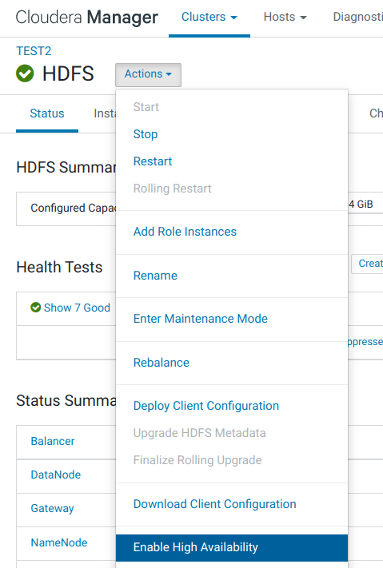
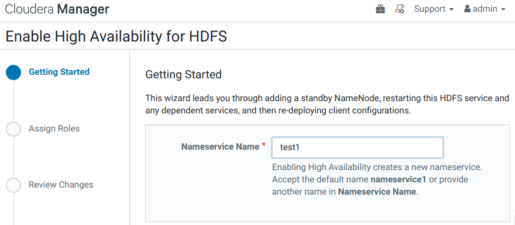
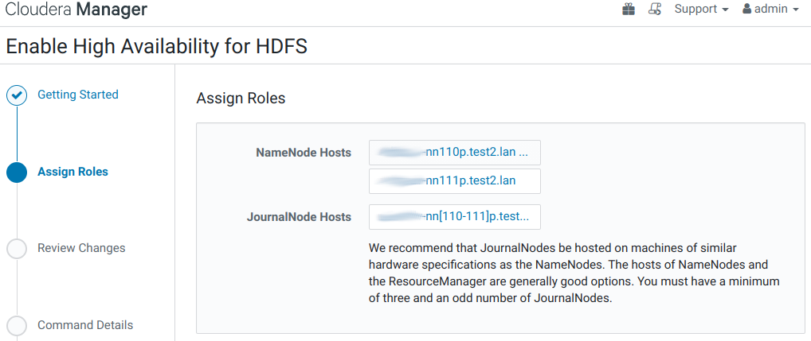
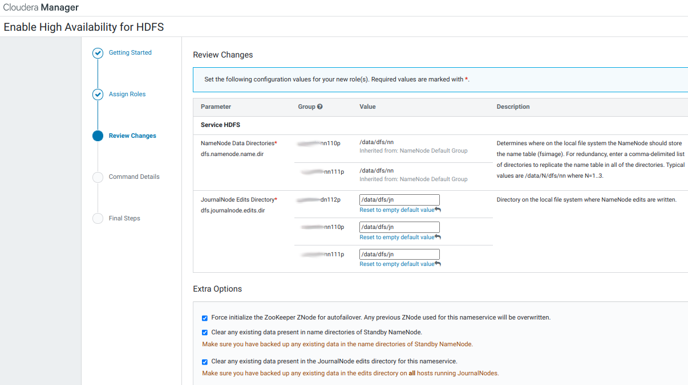
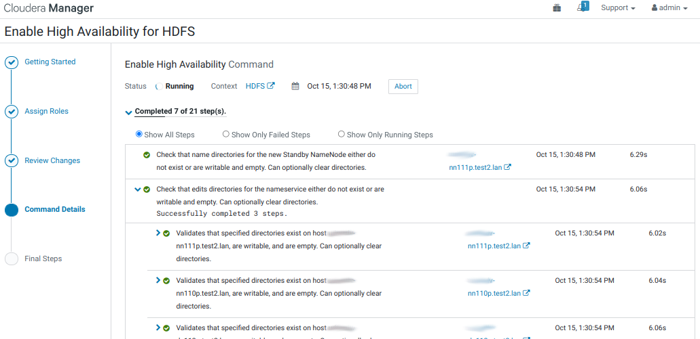
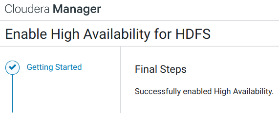
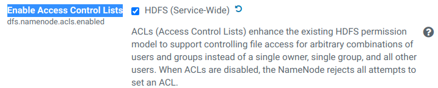
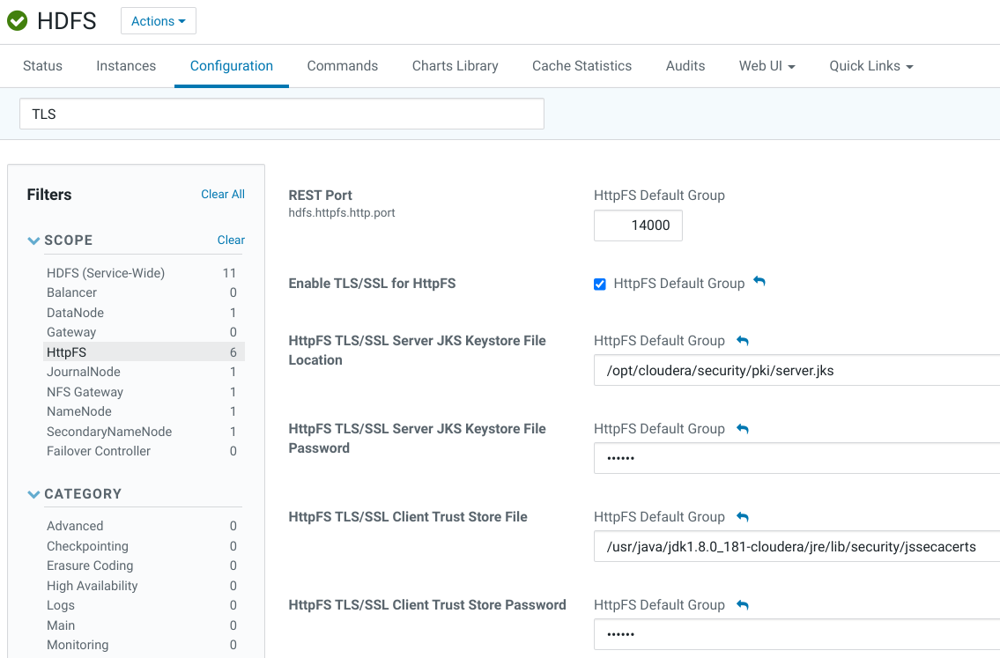
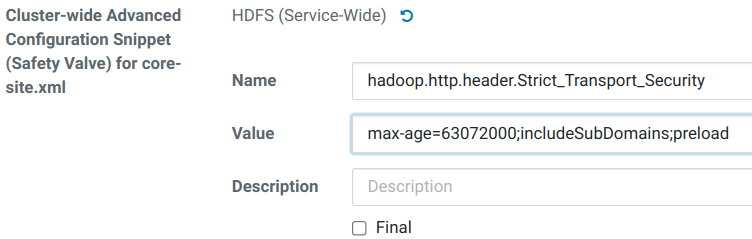

2021-07-09&nbsp;&ndash;&nbsp;2021-10-15

## 1. Enable High Availability
[Enabling HDFS HA](https://docs.cloudera.com/documentation/enterprise/6/6.3/topics/cdh_hag_hdfs_ha_enabling.html)

1. В настройках сервиса HDFS, используя фильтр по слову «dfs.journalnode.edits.dir», изменяем следующий параметр:
<table>
<tr>
<th>Property</th><th>Value</th><th>Description</th>
</tr>
<tr>
<td><b>JournalNode Edits Directory</b><br>
<i>dfs.journalnode.edits.dir</i></td>
<td>JournalNode Default Group:<br>
<span style="color: blue"><code>/data/dfs/jn</code></span></td>
<td>Directory on the local file system where NameNode edits are written.</td>
</tr>
</table>

2. Нажимаем Save Changes.
3. На странице службы HDFS, через кнопку Actions, запускаем wizard включения HA:
    <center></center>
4. **Getting Started.**
    Задаём уникальное имя для Nameservice:
    <center></center>
5. **Assign Roles**.<br>
    JournalNodes должны работать на хостах с такими же hardware specification, как NameNodes. Cloudera рекомендует поместить две JournalNode на те же хосты с NameNodes, а третий JournalNode на хост с похожими ресурсами, таким как JobTracker.<br>
    Распределяем роли:
    <center></center>
6. **Review Changes**.<br>
    Знакомимся с предварительными результатами и указываем каталог для JournalNode `/data/dfs/jn`:
    <center></center>
7. **Command Details**.
    <center></center>
8. **Final Steps**.
    <center></center>

## 2. Настройка LDAP-аутентификации в HDFS
{}
Важно пересмотреть эту настройку прямого подключения Hadoop к LDAP-каталогу. Нужно оставить использование `org.apache.hadoop.security.ShellBasedUnixGroupsMapping`, так как прозрачное подключение к LDAP на машинах введённых в домен уже реализовано через SSSD.

Переписать инструкцию!

Держать в уме, что после отключения HDFS LDAP Mapping, перестала работать аутентификация в Solr! К сожалению, не помню, Solr был добавлен до включения LDAP Mapping или после, что могло бы повлиять на такое его поведение.
{}

{}
При прямом подключении к LDAP не работают вложенные пользовательские группы?
{}

{}
Полезно в `/etc/sssd/sssd.conf` добавить фильтрацию Hadoop'овских УЗ и групп из LDAP в секции '[nss]', иначе одноимённая доменная УЗ возобладает преимуществом и нарушит работу hadoop-кластера.

```
[nss]
filter_groups = root,mysql,hadoop,yarn,hdfs,mapred,kms,httpfs,hbase,hive,sentry,spark,solr,sqoop,oozie,hue,flume,impala,llama,postgres,sqoop2,kudu,kafka,accumulo,zookeeper,cloudera-scm,keytrustee
filter_users = root,mysql,cloudera-scm,zookeeper,yarn,hdfs,mapred,kms,httpfs,hbase,hive,sentry,spark,solr,sqoop,oozie,hue,flume,impala,llama,sqoop2,postgres,kudu,kafka,accumulo,keytrustee
reconnection_retries = 3
```

Возможно, что полезно указывать, если используется прямое подключение к LDAP:
- [⚠ YARN History Server не отображает отработанные задачи после включения Kerberos](/manuals/bigdata/ustanovka-cloudera-cdh-6.3.2-s-tls-i-kerberos-na-osnove-freeipa/yarn-nastroyka/#41-yarn-history-server-%D0%BD%D0%B5-%D0%BE%D1%82%D0%BE%D0%B1%D1%80%D0%B0%D0%B6%D0%B0%D0%B5%D1%82-%D0%BE%D1%82%D1%80%D0%B0%D0%B1%D0%BE%D1%82%D0%B0%D0%BD%D0%BD%D1%8B%D0%B5-%D0%B7%D0%B0%D0%B4%D0%B0%D1%87%D0%B8-%D0%BF%D0%BE%D1%81%D0%BB%D0%B5-%D0%B2%D0%BA%D0%BB%D1%8E%D1%87%D0%B5%D0%BD%D0%B8%D1%8F-kerberos)
{}

1. В настройках службы HDFS, используя фильтр по слову «hadoop.security.group.mapping.ldap.ssl», изменяем следующие параметры:
<table>
<tr>
<th>Property</th><th>Value</th><th>Description</th>
</tr>
<tr>
<td><b>Hadoop User Group Mapping LDAP TLS/SSL Truststore</b><br>
<i>hadoop.security.group.mapping.ldap.ssl.keystore</i>
</td>
<td><span style="color: blue"><code>/usr/java/jdk1.8.0_181-cloudera/jre/lib/security/jssecacerts</code></span></td>
<td>File path to a jks-format truststore containing the TLS/SSL certificate used sign the LDAP server's certificate. Note that in previous releases this was erroneously referred to as a "keystore".</td>
</tr>
<tr>
<td><b>Hadoop User Group Mapping LDAP TLS/SSL Truststore Password</b><br>
<i>hadoop.security.group.mapping.ldap.ssl.keystore.password</i>
</td>
<td>По умолчанию: <span style="color: blue">changeit</span>.</td>
<td>The password for the TLS/SSL truststore.</td>
</tr>
</table>

2. Нажимаем **Save Changes**.
3. <span style="color: red">Используем следующие настройки только в случае использования прямого подключения Hadoop'а к LDAP, вместо рекомендованного подключения через SSSD.</span><br>
В настройках службы HDFS, используя категорию &laquo;Security&raquo;, изменяем следующие параметры:

<details>

<table border="1">
<tr>
<th>Property</th><th>Value</th><th>Description</th>
</tr>
<tr>
<td><b>Hadoop User Group Mapping Implementation</b><br>
<i>hadoop.security.group.mapping</i>
</td>
<td>
○&nbsp;org.apache.hadoop.security.JniBasedUnixGroupsMapping<br>
○&nbsp;org.apache.hadoop.security.ShellBasedUnixGroupsMapping<br>
<span style="color: blue">◉&nbsp;org.apache.hadoop.security.LdapGroupsMapping</span></td>
<td>Class for user to group mapping (get groups for a given user).</td>
</tr>
<tr>
<td><b>Hadoop User Group Mapping LDAP URL</b><br>
<i>hadoop.security.group.mapping.ldap.url</i></td>
<td><span style="color: blue">ldaps://dev-ipa01p.test.lan ldaps://dev-ipa02p.test.lan ldaps://dev-ipa03p.test.lan</span>
<br>Список из URL, разделённых пробелами.</td>
<td>The URL of the LDAP server. The URL must be prefixed with ldap:// or ldaps://. The URL can optionally specify a custom port, for example: ldaps://ldap_server.example.com:1636. Note that usernames and passwords will be transmitted in the clear unless either an ldaps:// URL is used, or "Enable LDAP TLS" is turned on (where available). Also note that encryption must be in use between the client and this service for the same reason.

For more detail on the LDAP URL format, see RFC 2255 . A space-separated list of URLs can be entered; in this case the URLs will each be tried in turn until one replies.</td>
</tr>
<tr>
<td><b>Hadoop User Group Mapping LDAP TLS/SSL Enabled</b><br>
<i>hadoop.security.group.mapping.ldap.use.ssl</i></td>
<td><span style="color: blue">☑</span></td>
<td>Whether or not to use TLS/SSL when connecting to the LDAP server.</td>
</tr>
<tr>
<td><b>Hadoop User Group Mapping LDAP TLS/SSL Truststore</b><br>
<i>hadoop.security.group.mapping.ldap.ssl.keystore</i></td>
<td><span style="color: blue"><code>/usr/java/jdk1.8.0_181-cloudera/jre/lib/security/jssecacerts</code></span></td>
<td>File path to a jks-format truststore containing the TLS/SSL certificate used sign the LDAP server's certificate. Note that in previous releases this was erroneously referred to as a "keystore".</td>
</tr>
<tr>
<td><b>Hadoop User Group Mapping LDAP TLS/SSL Truststore Password</b><br>
<i>hadoop.security.group.mapping.ldap.ssl.keystore.password</i></td>
<td>По умолчанию: <span style="color: blue">changeit</span>.</td>
<td>The password for the TLS/SSL truststore.</td>
</tr>
<tr>
<td><b>Hadoop User Group Mapping LDAP Bind User Distinguished Name</b><br>
<i>hadoop.security.group.mapping.ldap.bind.user</i></td>
<td><span style="color: blue">uid=binddn_test2,cn=sysaccounts,cn=etc,dc=test2,dc=lan</span></td>
<td>Distinguished name of the user to bind as. This is used to connect to LDAP/AD for searching user and group information. This may be left blank if the LDAP server supports anonymous binds.</td>
</tr>
<tr>
<td><b>Hadoop User Group Mapping LDAP Bind User Password</b><br>
<i>hadoop.security.group.mapping.ldap.bind.password</i></td>
<td>Пароль для вышеуказанного системного аккаунта binddn_test2.</td>
<td>The password of the bind user.</td>
</tr>
<tr>
<td><b>Hadoop User Group Mapping Search Base</b><br>
<i>hadoop.security.group.mapping.ldap.base</i></td>
<td><span style="color: blue">cn=accounts,dc=test2,dc=lan</span></td>
<td>The search base for the LDAP connection. This is a distinguished name, and will typically be the root of the LDAP directory.</td>
</tr>
<tr>
<td><b>Hadoop User Group Mapping LDAP User Search Filter</b><br>
<i>hadoop.security.group.mapping.ldap.search.filter.user</i></td>
<td><span style="color: blue">(&(objectClass=person)(uid={0}))</span></td>
<td>An additional filter to use when searching for LDAP users. The default will usually be appropriate for Active Directory installations. If connecting to a generic LDAP server, ''sAMAccountName'' will likely be replaced with ''uid''. {0} is a special string used to denote where the username fits into the filter.</td>
</tr>
<tr>
<td><b>Hadoop User Group Mapping LDAP Group Search Filter</b><br>
<i>hadoop.security.group.mapping.ldap.search.filter.group</i></td>
<td><span style="color: blue">(objectClass=ipausergroup)</span></td>
<td>An additional filter to use when searching for groups.</td>
</tr>
<tr>
<td><b>Hadoop User Group Mapping LDAP Group Membership Attribute</b><br>
<i>hadoop.security.group.mapping.ldap.search.attr.member</i></td>
<td><span style="color: blue">member</span></td>
<td>The attribute of the group object that identifies the users that are members of the group. The default will usually be appropriate for any LDAP installation.</td>
</tr>
<tr>
<td><b>Hadoop User Group Mapping LDAP Group Name Attribute</b><br>
<i>hadoop.security.group.mapping.ldap.search.attr.group.name</i></td>
<td><span style="color: blue">cn</span></td>
<td>The attribute of the group object that identifies the group name. The default will usually be appropriate for all LDAP systems.</td>
</tr>
</table>

- Нажимаем Save Changes.

</details>

## 3. Создание группы для доступа в HDFS с правами superuser
{}
Проверено в кластере TEST2 в домене test2.lan.

- HDFS-сервис не был переведён на 'org.apache.hadoop.security.LdapGroupsMapping', то есть испытания проводились в режиме 'org.apache.hadoop.security.ShellBasedUnixGroupsMapping'.
- Posix-группа 'test2_hdfs_su' создана во FreeIPA и указана в параметре 'dfs.permissions.superusergroup'. Non-posix группа не сработала.
- В группу 'test2_hdfs_su' была вложена группа 'dom_admins', участником которой была УЗ 'eugene'.

В результате, наблюдаем, что УЗ 'eugene', которая является участником группы 'dom_admins', также распознаётся hadoop'ом, как участник и родительской группы 'test2_hdfs_su':

$ hdfs groups eugene
eugene : eugene test2_hdfs_su dom_admins
{}

{}
В другом кластере применил схему eugene --> dom_admins --> test01_superadmins. А нруппа test01_superadmins является участником всех кластерных групп. Результат:

hdfs groups eugene
eugene : eugene dom_admins test01_yarn_admins test01_hbase_su test01_hdfs_su test01_superadmins test01_sentry_admins test01_hue_admins
{}

### 3.1. Добавление группы во FreeIPA
Чтобы иметь возможность, например, создавать в HDFS home-каталоги для пользователей, нам нужен доступ к HDFS-superuser аккаунту. Напомню, что CDH автоматически создаёт HDFS superuser аккаунт&nbsp;&mdash;&nbsp;'hdfs'&nbsp;&mdash;&nbsp;на каждом узле кластера в процессе первичной инстралляции. Но после включения Kerberos для HDFS служб, мы теряем доступ к использованию `sudo -u hdfs`. Поэтому, мы создадим в IPA posix-группу 'test1_hdfs_su', укажем её в соответствующей настройке HDFS-сервиса, в результате чего участники этой группы, а также участники подгрупп, возобладают правами superuser'а в HDFS.

1. Добавление группы во FreeIPA. Так как установка кластера производится с машины, домен которой отличен от домена настраиваемых машин, то вновь используем ansible:
```bash
ADM_USER='eugene'
ADM_PASS='JL9d]qtw$p=2=M2K=~z?|EU,'
CL_NAME="TEST1"          # UPPERCASE
CL_NAME_L=${CL_NAME,,}   # lowercase

ansible mgm -i cluster.inv -m shell -a "echo '${ADM_PASS}' | kinit ${ADM_USER} && \
ipa group-add --desc='HDFS superusers for cluster ${CL_NAME}' ${CL_NAME_L}_hdfs_su"
```

<details><summary>stdout...</summary>

```bash
10.15.120.140 | CHANGED | rc=0 >>
Password for admin@TEST.LAN:
---------------------------
Added group "test1_hdfs_su"
---------------------------
  Group name: test1_hdfs_su
  Description: HDFS superusers for cluster TEST1
  GID: 1262100012
```

</details>

### 3.2. Указание Non-Default Superuser Group
1. В настройках службы HDFS, используя фильтр по слову &laquo;dfs.permissions.superusergroup&raquo;, изменяем следующий параметр:
<table>
<tr>
<th>Property</th><th>Value</th><th>Description</th>
</tr>
<tr>
<td><b>Superuser Group</b><br>
<i>dfs.permissions.superusergroup</i>
</td>
<td><span style="color: blue">test1_hdfs_su</span></td>
<td>The name of the group of superusers.</td>
</tr>
</table>

2. Нажимаем **Save Changes**.

## 4. Configuring Encrypted Transport for HDFS
Перед настройкой передачи зашифрованных данных HDFS необходимо включить Kerberos. См. Инструкции в разделе «Аутентификация».

1. В настройках службы HDFS, используя фильтр «Protection», изменяем следующие параметры:
<table>
<tr>
<th>Property</th><th>Value</th><th>Description</th>
</tr>
<tr>
<td><b>DataNode Data Transfer Protection</b><br>
<i>dfs.data.transfer.protection</i>
</td>
<td>
<span style="color: gray">HDFS (Service-Wide)</span><br>
○&nbsp;Authentication<br>
○&nbsp;Integrity<br>
<span style="color: blue">◉&nbsp;Privacy</span></td>
<td>SASL protection mode for secured connections to the DataNodes when reading or writing data. Value is the type of SASL protection to be used for secured connections to the DataNode when reading or writing block data. Possible values are 'authentication', 'integrity' and 'privacy'. <b>authentication</b> means authentication only and no integrity or privacy; <b>integrity</b> implies that only authentication and integrity are enabled; and <b>privacy</b> implies all of authentication, integrity and privacy are enabled. If "Enable Data Transfer Encryption" is set to true, then it supersedes the setting for this parameter and enforces that all connections must use a specialized encrypted SASL handshake. This property is ignored for connections to a DataNode listening on a privileged port. In this case, it is assumed that the use of a privileged port establishes sufficient trust.</td>
</tr>
<tr>
<td><b>Hadoop RPC Protection</b><br>
<i>hadoop.rpc.protection</i>
</td>
<td>
○&nbsp;authentication<br>
○&nbsp;integrity<br>
<span style="color: blue">◉&nbsp;privacy</span></td>
<td>Quality of protection for secured RPC connections between NameNode and HDFS clients. For effective RPC protection, enable Kerberos authentication.</td>
</tr>
<tr>
<td><b>Enable Data Transfer Encryption</b><br>
<i>dfs.encrypt.data.transfer</i>
</td>
<td><span style="color: blue">☑</span></td>
<td>Enable encryption of data transfer between DataNodes and clients, and among DataNodes. When enabled, block data that is read/written from/to HDFS will be encrypted on the wire. For effective data transfer protection, enable Kerberos authentication and pick privacy for "Hadoop RPC Protection".</td>
</tr>
</table>

2. В настройках службы HDFS, используя фильтр «dfs.encrypt.data.transfer.algorithm», проверяем следующие параметры:
<table>
<tr>
<th>Property</th><th>Value</th><th>Description</th>
</tr>
<tr>
<td><b>Data Transfer Encryption Algorithm</b><br>
<i>dfs.encrypt.data.transfer.algorithm</i>
</td>
<td>
<span style="color: gray">HDFS (Service-Wide)</span><br>
○&nbsp;3des<br>
○&nbsp;rc4<br>
<span style="color: blue">◉&nbsp;AES/CTR/NoPadding</span></td>
<td>Algorithm to encrypt data transfer between DataNodes and clients, and among DataNodes. If 3des or rc4 are chosen, the entire communication is encrypted with that algorithm. In CDH 5.4 and higher, if AES/CTR/NoPadding is chosen, 3des is used for the initial key exchange, and then AES/CTR/NoPadding is used for the transfer of data. This is the most secure option, and is recommended for clusters running CDH 5.4 or higher. It also requires that the "openssl-devel" package be installed on all machines in the cluster. When this parameter is changed, a full, nonrolling restart of the cluster must be performed.</td>
</tr>
</table>

3. Нажимаем **Save Changes**.
4. Перезапускаем все зависимые сервисы по приглашению Cloudera Manager Console.

## 5. Включение ACL для HDFS
В настройках роли HDFS, используя фильтр «dfs.namenode.acls.enabled», включаем параметр «Enable Access Control Lists».
<center></center>

## 6. Настройка TLS для HttpFS
1. В настройках службы HDFS, используя фильтр «HttpFS TLS», изменяем следующие параметры:
<table>
<tr>
<th>Property</th><th>Value</th><th>Description</th>
</tr>
<tr>
<td><b>Signature Secret</b><br>
<i>hdfs.httpfs.signature.secret</i>
</td>
<td>???? (разобраться, что здесь указано или надо указывать) (этот параметр пересекается с таким же параметром из Hue)</td>
<td>The secret to use for signing client authentication tokens.</td>
</tr>
<tr>
<td><b>Enable TLS/SSL for HttpFS</b><br>
</td>
<td><span style="color: blue">☑</span></td>
<td>Encrypt communication between clients and HttpFS using Transport Layer Security (TLS) (formerly known as Secure Socket Layer (SSL)).</td>
</tr>
<tr>
<td><b>HttpFS TLS/SSL Server JKS Keystore File Location</b><br>
</td>
<td><span style="color: blue"><code>/opt/cloudera/security/pki/server.jks</code></span></td>
<td>The path to the TLS/SSL keystore file containing the server certificate and private key used for TLS/SSL. Used when HttpFS is acting as a TLS/SSL server. The keystore must be in JKS format.</td>
</tr>
<tr>
<td><b>HttpFS TLS/SSL Server JKS Keystore File Password</b><br>
</td>
<td>По умолчанию: <span style="color: blue">changeit</span>.</td>
<td>The password for the HttpFS JKS keystore file.</td>
</tr>
<tr>
<td><b>HttpFS TLS/SSL Client Trust Store File</b><br>
</td>
<td><span style="color: blue"><code>/usr/java/jdk1.8.0_181-cloudera/jre/lib/security/jssecacerts</code></span></td>
<td>The location on disk of the trust store, in .jks format, used to confirm the authenticity of TLS/SSL servers that HttpFS might connect to. This is used when HttpFS is the client in a TLS/SSL connection. This trust store must contain the certificate(s) used to sign the service(s) connected to. If this parameter is not provided, the default list of well-known certificate authorities is used instead.</td>
</tr>
<tr>
<td><b>HttpFS TLS/SSL Client Trust Store Password</b><br>
</td>
<td>По умолчанию: <span style="color: blue">changeit</span>.</td>
<td>The password for the HttpFS TLS/SSL Certificate Trust Store File. This password is not required to access the trust store; this field can be left blank. This password provides optional integrity checking of the file. The contents of trust stores are certificates, and certificates are public information.</td>
</tr>
</table>
<center></center>

2. Нажимаем **Save Changes**.
{}
Connect to the HttpFS Web UI using TLS/SSL (HTTPS)

Use https://<httpfs_server_hostname>:14000/webhdfs/v1/, though most browsers should automatically redirect you if you use http://<httpfs_server_hostname>:14000/webhdfs/v1/
{}

## 7. Настройка HSTS для HDFS
Настройка строгой транспортной безопасности HTTP (HSTS) для HDFS гарантирует, что веб-браузер не загружает служебную информацию с помощью HTTP. Кроме того, все попытки загрузить информацию с помощью HTTP будут автоматически преобразованы в HTTPS.

Perform the following steps to configure HSTS for HDFS:

1. Go to the **HDFS** service.
2. Click the Configuration tab.
3. Set the HSTS credentials in Cluster-wide Advanced Configuration Snippet (Safety Valve) for core-site.xml.
```
<property>
<name>hadoop.http.header.Strict_Transport_Security</name>
<value>max-age=63072000;includeSubDomains;preload</value>
</property>
```
4. If required, configure additional headers by using the safety value specified in the previous step for the hadoop.http.header.http-header property.
    <center></center>
5. Нажимаем **Save Changes**.
6. Перезапускаем все зависимые сервисы по приглашению Cloudera Manager Console.
