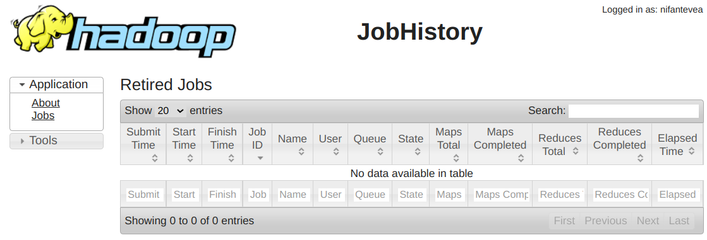

2021-07-09

## 1. Перенастройка размещения log'ов
1. В настройках YARN, используя фильтр '/var/log', изменяем только следующие параметры, добавляя имя каталога '/data' вместо '/var':
<table>
<tr>
<th>Property</th><th>Value</th><th>Description</th>
</tr>
<tr>
<td><b>JobHistory Server Log Directory</b><br>
<i>hadoop.log.dir</i>
</td>
<td><span style="color: blue"><code>/data/log/hadoop-mapreduce</code></span></td>
<td>Directory where JobHistory Server will place its log files.</td>
</tr>
<tr>
<td><b>NodeManager Log Directory</b><br>
<i>hadoop.log.dir</i>
</td>
<td><span style="color: blue"><code>/data/log/hadoop-yarn</code></span></td>
<td>Directory where NodeManager will place its log files.</td>
</tr>
<tr>
<td><b>ResourceManager Log Directory</b><br>
<i>hadoop.log.dir</i>
</td>
<td><span style="color: blue"><code>/data/log/hadoop-yarn</code></span></td>
<td>Directory where ResourceManager will place its log files.</td>
</tr>
</table>

2. Нажимаем **Save Changes**.

## 2. Настройка ACL
[Managing YARN ACLs](https://docs.cloudera.com/documentation/enterprise/6/6.3/topics/cm_mc_yarn_acl.html)

1. Во FreeIPA добавляем группу 'test1_yarn_admins':
```
ADM_USER='eugene' \
ADM_PASS='JL9d]qtw$p=2=M2K=~z?|EU,' \
CL_NAME="TEST1"          # UPPERCASE \
CL_NAME_L=${CL_NAME,,}   # lowercase

ansible mgm -i cluster.inv -m shell -a "echo '${ADM_PASS}' | kinit ${ADM_USER} && \
ipa group-add --desc='YARN admins for cluster ${CL_NAME}' ${CL_NAME_L}_yarn_admins"
```

2. В настройках YARN, используя фильтр «acl», изменяем только следующие параметры:
<table>
<tr>
<th>Property</th><th>Value</th><th>Description</th>
</tr>
<tr>
<td><b>Enable ResourceManager ACLs</b><br>
<i>yarn.acl.enable</i>
</td>
<td><span style="color: blue">☑</span></td>
<td>Whether users and groups specified in Admin ACL should be checked for authorization to perform admin operations.</td>
</tr>
<tr>
<td><b>Admin ACL</b><br>
<i>yarn.admin.acl</i>
</td>
<td><p><span style="color: blue"><code> test1_yarn_admins</code></span></p>
<p>Так как указываем только группу, то в начале строки вставляем пробел, разделяющий пользователей и группы.</p>
<p><span style="color: red">На данный момент нет понимания работы этого параметра. Необходимы дополнительные изыскания.</span></p>
</td>
<td>ACL that determines which users and groups can submit and kill applications in any pool, and can issue commands on ResourceManager roles.</td>
</tr>
<tr>
<td><b>ACL For Viewing A Job</b><br>
<i>mapreduce.job.acl-view-job</i>
</td>
<td><span style="color: blue"><code> </code></span><br>
По умолчанию установлен пробел.</td>
<td>Specifies a list of users and/or groups that are allowed to view private job details. For specifying a list of users and groups the format to use is "user1,user2 group1,group". If set to '*', it allows all users/groups to modify this job. If set to ' '(i.e. space), it allows none. Irrespective of this ACL configuration, (a) job-owner, (b) the user who started the cluster, (c) members of an admin configured supergroup configured via mapreduce.cluster.permissions.supergroup and (d) queue administrators of the queue to which this job was submitted to configured via acl-administer-jobs for the specific queue in mapred-queues.xml can do all the view operations on a job. Ignored unless mapreduce.cluster.acls.enabled is true.</td>
</tr>
<tr>
<td><b>ACL For Modifying A Job</b><br>
<i>mapreduce.job.acl-modify-job</i>
</td>
<td><span style="color: blue"><code> </code></span><br>
По умолчанию установлен пробел.</td>
<td>Specifies a list of users and/or groups that are allowed to modify job operations. For specifying a list of users and groups the format to use is "user1,user2 group1,group". If set to '*', it allows all users/groups to modify this job. If set to ' '(i.e. space), it allows none. Irrespective of this ACL configuration, (a) job-owner, (b) the user who started the cluster, (c) members of an admin configured supergroup configured via mapreduce.cluster.permissions.supergroup and (d) queue administrators of the queue to which this job was submitted to configured via acl-administer-jobs for the specific queue in mapred-queues.xml can do all the modification operations on a job. Ignored unless mapreduce.clouster.acls.enabled is true.</td>
</tr>
<tr>
<td><b>Enable Job ACL</b><br>
<i>mapreduce.cluster.acls.enabled</i>
</td>
<td><span style="color: blue">☑</span></td>
<td>Specifies whether ACLs should be checked for authorization when users perform various operations. If enabled, access control checks are made by MapReduce when requests are made by users for queue operations and job operations. Queue operations include submitting job to a queue or killing a job in the queue. Job operations include viewing the job-details (See mapreduce.job.acl-view-job), or modifying a job (See mapreduce.job.acl-modify-job).</td>
</tr>
</table>

3. В настройках YARN, используя фильтр «Admin Users Applications List», изменяем только следующие параметры:
<table>
<tr>
<th>Property</th><th>Value</th><th>Description</th>
</tr>
<tr>
<td><b>Admin Users Applications List Visibility Settings</b><br>
</td>
<td><span style="color: blue">◉&nbsp;All</span><br>
○&nbsp;Their&nbsp;own&nbsp;only<br>
○&nbsp;None
</td>
<td>Controls which applications an admin user can see in the applications list view</td>
</tr>
<tr>
<td><b>Non-Admin Users Applications List Visibility Settings</b><br>
</td>
<td>
○&nbsp;All<br>
<span style="color: blue">◉&nbsp;Their&nbsp;own&nbsp;only</span><br>
○&nbsp;None
</td>
<td>Controls which applications non-admin users can see in the applications list view</td>
</tr>
</table>

## 3. Выполнение тестового задания
Попробуем запустить sleep или pi задание из предоставленных примеров Hadoop (`/usr/lib/hadoop/hadoop-examples.jar`) на машине с ролью 'YARN Gateway'.

1. Продолжаем использовать ansible, с помощью которого на mgm-машине получаем kerberos-тикет и запускаем тестовое задание вычисления числа Пи. Наблюдаем приблизительный результат вычислений:
    ```bash
    $ ADM_USER='eugene' \
      ADM_PASS='JL9d]qtw$p=2=M2K=~z?|EU,'

    $ ansible mgm -i cluster.inv -m shell -a "echo '${ADM_PASS}' | kinit '${ADM_USER}' && \
      hadoop jar /usr/lib/hue/apps/oozie/examples/lib/hadoop-examples.jar pi 10 10000 2>&1"
    ...
    Job Finished in 2.938 seconds
    Estimated value of Pi is 3.14120000000000000000
    ```

2. Ради любопытства, запустил вычисление числа Пи с другими значениями и результат оказался ближе к истине:
    ```bash
    $ ansible mgm -i cluster.inv -m shell -a "echo '${ADM_PASS}' | kinit '${ADM_USER}' && \
      hadoop jar /usr/lib/hue/apps/oozie/examples/lib/hadoop-examples.jar pi 50 10000 2>&1"
    ...
    Job Finished in 5.528 seconds
    Estimated value of Pi is 3.14159200000000000000
    ```

3. Проверяем процесс и результаты в WebUI.

## 4. Встреченные проблемы
### 4.1. YARN History Server не отображает отработанные задачи после включения Kerberos
#### 4.1.1. Симптомы
1. На странице YARN History Server пустая таблица задач:
    <center></center>

2. В логах записи:
    <pre>
    HistoryFileManager
    Error while trying to scan the directory hdfs://test1:8020/user/history/done_intermediate/eugene
    org.apache.hadoop.security.AccessControlException: Permission denied: user=mapred, access=READ_EXECUTE, inode="/user/history/done_intermediate/eugene":eugene:hadoop:drwxrwx---
    ...
    Caused by: org.apache.hadoop.ipc.RemoteException(org.apache.hadoop.security.AccessControlException): Permission denied: user=mapred, access=READ_EXECUTE, inode="/user/history/done_intermediate/eugene":eugene:hadoop:drwxrwx---
    </pre>
    <pre>
    AggregatedLogDeletionService
    Could not read the contents of hdfs://test1/tmp/logs/eugene/logs Permission denied: user=mapred, access=EXECUTE, inode="/tmp/logs/eugene":eugene:hadoop:drwxrwx---
    </pre>

#### 4.1.2. Сбор информации
1. Проверяем права на каталоги:
    ```
    drwxr-xr-x   - hdfs supergroup        0 2021-07-21 16:37 /

    # Ветка каталогов, где создаётся временный каталог с файлами выполняющегося задания. Информация не удаляется?
    drwxrwxrwt   - hdfs supergroup        0 2021-07-28 10:23 /tmp
    drwxrwxrwt   - mapred hadoop          0 2021-05-07 18:43 /tmp/logs

    # Ветка хранения истории yarn и spark заданий - /user/history.
    drwxr-xr-x   - hdfs supergroup        0 2021-07-12 16:09 /user
    drwxrwxrwx   - mapred hadoop          0 2021-06-30 15:15 /user/history

    # Ветка done_intermediate/, где сохраняются файлы заданиями между /tmp/logs/ и /user/history/done/. Зачем? Пока не знаю.
    drwxrwxrwt   - mapred hadoop          0 2021-07-30 10:56 /user/history/done_intermediate
    drwxrwx---   - eugene hadoop      0 2021-07-30 10:56 /user/history/done_intermediate/eugene

    -rwxrwx---   3 eugene hadoop      56883 2021-07-30 10:56 /user/history/done_intermediate/eugene/job_16...SUC...7.jhist
    -rwxrwx---   3 eugene hadoop        453 2021-07-30 10:56 /user/history/done_intermediate/eugene/job_16...1.summary
    -rwxrwx---   3 eugene hadoop     222521 2021-07-30 10:56 /user/history/done_intermediate/eugene/job_16...1_conf.xml

    # Ветка done/, где сохраняются завершённые задания. Срок хранение по умолчанию 7 дней?
    drwxrwx--x   - mapred hadoop          0 2021-04-22 21:55 /user/history/done
    drwxrwx--x   - mapred hadoop          0 2021-08-01 12:56 /user/history/done/2021/08/01/000000
    -rwxrwx---  3 eugenetest hadoop  56814 2021-08-01 12:33 /user/history/done/2021/08/01/000000/job_16...SUС...56.jhist
    ```

2. Изначальная УЗ 'mapred', ещё до включения Kerberos, являлась участником локальной группы 'hadoop', поэтому имела доступ каталогам с группой-владельцем  'hadoop', типа `/user/history/done_intermediate/eugene`. Но, похоже,  после включения Kerberos, бывшая УЗ mapred становится отображением kerberos-УЗ 'mapred@TEST.LAN'. А так как новая УЗ 'mapred@TEST.LAN' не является участником LDAP-группы 'hadoop' (такой группы вообще нет во FreeIPA, то и доступ к каталогам с группой-владельцем 'hadoop' перестаёт работать.<br>
Получим тикет для УЗ mapred и посмотрим членство в группах:<br>
    ```bash
    # klist -kt /var/run/cloudera-scm-agent/process/1729-yarn-JOBHISTORY/mapred.keytab
    Keytab name: FILE:/var/run/cloudera-scm-agent/process/1729-yarn-JOBHISTORY/mapred.keytab
    KVNO Timestamp           Principal
    ---- ------------------- ------------------------------------------------------
       1 30.07.2021 12:45:11 HTTP/dev-hbr91p.test.lan@TEST.LAN
       1 30.07.2021 12:45:11 HTTP/dev-hbr91p.test.lan@TEST.LAN
       1 30.07.2021 12:45:11 HTTP/dev-hbr91p.test.lan@TEST.LAN
       1 30.07.2021 12:45:11 HTTP/dev-hbr91p.test.lan@TEST.LAN
       1 30.07.2021 12:45:11 HTTP/dev-hbr91p.test.lan@TEST.LAN
       1 30.07.2021 12:45:11 HTTP/dev-hbr91p.test.lan@TEST.LAN
       1 30.07.2021 12:45:11 mapred/dev-hbr91p.test.lan@TEST.LAN
       1 30.07.2021 12:45:11 mapred/dev-hbr91p.test.lan@TEST.LAN
       1 30.07.2021 12:45:11 mapred/dev-hbr91p.test.lan@TEST.LAN
       1 30.07.2021 12:45:11 mapred/dev-hbr91p.test.lan@TEST.LAN
       1 30.07.2021 12:45:11 mapred/dev-hbr91p.test.lan@TEST.LAN
       1 30.07.2021 12:45:11 mapred/dev-hbr91p.test.lan@TEST.LAN


    # kinit -kt /var/run/cloudera-scm-agent/process/1729-yarn-JOBHISTORY/mapred.keytab mapred/dev-hbr91p.test.lan@TEST.LAN

    # klist
    Ticket cache: FILE:/tmp/krb5cc_0
    Default principal: mapred/dev-hbr91p.test.lan@TEST.LAN

    Valid starting       Expires              Service principal
    01.08.2021 13:46:45  02.08.2021 13:46:45  krbtgt/TEST.LAN@TEST.LAN
            renew until 08.08.2021 13:46:45

    # hdfs groups
    mapred/dev-hbr91p.test.lan@TEST.LAN :

    # id mapred
    uid=993(mapred) gid=989(mapred) groups=989(mapred),991(hadoop)
    ```
    В последних строках листинга видно, что kerberos-УЗ 'mapred/dev-hbr91p.test.lan@TEST.LAN' не имеет членства в какой-либо группе, тогда как локальная группа 'mapred' на хосте 'dev-hbr91p.test.lan' принимает участие в группе 'hadoop'.

  3. Во FreeIPA не наблюдаются пользователи и группы, которые бы отображались в такие-же на кластере.

#### 4.1.3. Лечение
1. <strike>Необходимо добавить во FreeIPA УЗ и группы для отображения их на соответствующие УЗ и группы Хадупа.</strike>
2. Это произошло после включения прямого LDAP Mapping в сервисе HDFS, тогда как правильней не включать 'org.apache.hadoop.security.LdapGroupsMapping', а оставить использование стандартной 'org.apache.hadoop.security.ShellBasedUnixGroupsMapping' с авторизацией во FreeIPA через SSSD.
3. В `/etc/sssd/sssd.conf` добавить фильтрацию Hadoop'овских УЗ и групп из LDAP в секции [nss]:
    ```
    [nss]
    filter_groups = root,mysql,hadoop,yarn,hdfs,mapred,kms,httpfs,hbase,hive,sentry,spark,solr,sqoop,oozie,hue,flume,impala,llama,postgres,sqoop2,kudu,kafka,accumulo,zookeeper,cloudera-scm,keytrustee
    filter_users = root,mysql,cloudera-scm,zookeeper,yarn,hdfs,mapred,kms,httpfs,hbase,hive,sentry,spark,solr,sqoop,oozie,hue,flume,impala,llama,sqoop2,postgres,kudu,kafka,accumulo,keytrustee
    reconnection_retries = 3
    ```
