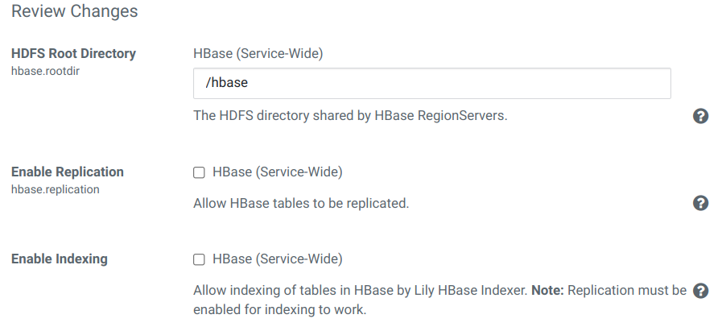

## Использованные материалы
1. [Manually Configuring TLS/SSL Encryption for CDH Services](https://docs.cloudera.com/documentation/enterprise/6/6.3/topics/cm_sg_hadoop_ssl_cm.html)

## 1. Добавление сервиса HBase
1. В консоли Cloudera Manager в меню выбираем «Add Service»:
    <center></center>
2. Выбираем HBase.
3. Распределяем роли. Хосты с именем hbr под HBase Region Servers...
    <center></center>
4. На следующем шаге оставляем настройки без изменений:
    <center></center>
5. Ждём добавления сервиса в кластер.
6. После успешного завершения процесса заканчиваем мастер нажатием на 'Finish'.
7. Перезапускаем все зависимые сервисы по приглашению Cloudera Manager Console.

## 2. Перенастройка размещения log'ов
1. В настройках HBase, используя фильтр '/var/', изменяем следующие параметры, добавляя '/data' вместо '/var':
<table>
<tr>
<th>Property</th><th>Value</th><th>Description</th>
</tr>
<tr>
<td><b>HBase REST Server Log Directory</b><br>
<i>hadoop.log.dir</i>
</td>
<td><span style="color: blue"><code>/data/log/hbase</code></span></td>
<td>Directory where HBase REST Server will place its log files.</td>
</tr>
<tr>
<td><b>HBase Thrift Server Log Directory</b><br>
<i>hadoop.log.dir</i>
</td>
<td><span style="color: blue"><code>/data/log/hbase</code></span></td>
<td>Directory where HBase Thrift Server will place its log files.</td>
</tr>
<tr>
<td><b>Master Log Directory</b><br>
<i>hadoop.log.dir</i>
</td>
<td><span style="color: blue"><code>/data/log/hbase</code></span></td>
<td>Directory where Master will place its log files.</td>
</tr>
<tr>
<td><b>RegionServer Log Directory</b><br>
<i>hadoop.log.dir</i>
</td>
<td><span style="color: blue"><code>/data/log/hbase</code></span></td>
<td>Directory where RegionServer will place its log files.</td>
</tr>
</table>

2. Нажимаем **Save Change**.

## 3. Настройка TLS для HBase
### 3.1. Прежде чем вы начнете
- Перед включением TLS убедитесь, что хранилища ключей, содержащие сертификаты, привязанные к соответствующим доменным именам, должны быть доступны на всех хостах, на которых работает хотя бы одна роль демона HBase.
Хранилища ключей для HBase должны принадлежать группе hbase и иметь разрешения 0440 (то есть быть доступными для чтения владельцем и группой).
- Вы должны указать абсолютные пути к файлам хранилища ключей и доверенных сертификатов. Эти настройки применяются ко всем хостам, на которых выполняются роли демонов службы HBase. Следовательно, выбранные вами пути должны быть действительны на всех хостах.
- Cloudera Manager поддерживает конфигурацию TLS для HBase на уровне сервиса. Убедитесь, что вы указали абсолютные пути к файлам хранилища ключей и доверенных сертификатов. Эти настройки применяются ко всем хостам, на которых выполняются роли демонов рассматриваемой службы. Следовательно, выбранные вами пути должны быть действительны на всех хостах.
- Следствием этого является то, что имена файлов хранилища ключей для данной службы должны быть одинаковыми на всех хостах. Если, например, вы получили отдельные сертификаты для демонов HBase на хостах node1.example.com и node2.example.com, вы могли выбрать для хранения этих сертификатов файлы с именами hbase-node1.keystore и hbase-node2.keystore ( соответственно). При развертывании этих хранилищ ключей вы должны дать им одинаковое имя на целевом хосте, например, hbase.keystore.

### 3.2. Настройка TLS для HBase
В настройках службы HBase, используя фильтр «TLS», изменяем следующие параметры:
<table>
<tr>
<th>Property</th><th>Value</th><th>Description</th>
</tr>
<tr>
<td><b>Web UI TLS/SSL Encryption Enabled</b><br>
<i>hadoop.ssl.enabled, hbase.ssl.enabled</i>
</td>
<td><span style="color: blue">☑</span></td>
<td>Enable TLS/SSL encryption for the HBase Master, RegionServer, Thrift Server, and REST Server web UIs.</td>
</tr>
<tr>
<td><b>HBase TLS/SSL Server JKS Keystore File Location</b><br>
<i>ssl.server.keystore.location</i>
</td>
<td><span style="color: blue"><code>/opt/cloudera/security/pki/server.jks</code></span></td>
<td>Path to the keystore file containing the server certificate and private key used for encrypted web UIs.</td>
</tr>
<tr>
<td><b>HBase TLS/SSL Server JKS Keystore File Password</b><br>
<i>ssl.server.keystore.password</i>
</td>
<td>По умолчанию: <span style="color: blue">changeit</span>.</td>
<td>Password for the server keystore file used for encrypted web UIs.</td>
</tr>
<tr>
<td><b>HBase TLS/SSL Server JKS Keystore Key Password</b><br>
<i>ssl.server.keystore.keypassword</i>
</td>
<td>По умолчанию: <span style="color: blue">changeit</span>.</td>
<td>Password that protects the private key contained in the server keystore used for encrypted web UIs.</td>
</tr>
</table>

2. Настройка TLS для HBase REST Server.
<table>
<tr>
<th>Property</th><th>Value</th><th>Description</th>
</tr>
<tr>
<td><b>Enable TLS/SSL for HBase REST Server</b><br>
</td>
<td><span style="color: blue">☑</span></td>
<td>Encrypt communication between clients and HBase REST Server using Transport Layer Security (TLS).</td>
</tr>
<tr>
<td><b>HBase REST Server TLS/SSL Server JKS Keystore File Location</b><br>
</td>
<td><span style="color: blue"><code>/opt/cloudera/security/pki/server.jks</code></span></td>
<td>The path to the TLS/SSL keystore file containing the server certificate and private key used for TLS/SSL. Used when HBase REST Server is acting as a TLS/SSL server. The keystore must be in JKS format.file.</td>
</tr>
<tr>
<td><b>HBase REST Server TLS/SSL Server JKS Keystore File Password</b><br>
</td>
<td>По умолчанию: <span style="color: blue">changeit</span>.</td>
<td>The password for the HBase REST Server JKS keystore file.</td>
</tr>
<tr>
<td><b>HBase REST Server TLS/SSL Server JKS Keystore Key Password</b><br>
</td>
<td>По умолчанию: <span style="color: blue">changeit</span>.</td>
<td>The password that protects the private key contained in the JKS keystore used when HBase REST Server is acting as a TLS/SSL server.</td>
</tr>
</table>

3. Настройка TLS для HBase Thrift Server.
<table>
<tr>
<th>Property</th><th>Value</th><th>Description</th>
</tr>
<tr>
<td><b>Enable TLS/SSL for HBase Thrift Server over HTTP</b><br>
</td>
<td><span style="color: blue">☑</span></td>
<td>Encrypt communication between clients and HBase Thrift Server over HTTP using Transport Layer Security (TLS).</td>
</tr>
<tr>
<td><b>HBase Thrift Server over HTTP TLS/SSL Server JKS Keystore File Location</b><br>
</td>
<td><span style="color: blue"><code>/opt/cloudera/security/pki/server.jks</code></span></td>
<td>Path to the TLS/SSL keystore file (in JKS format) with the TLS/SSL server certificate and private key. Used when HBase Thrift Server over HTTP acts as a TLS/SSL server.</td>
</tr>
<tr>
<td><b>HBase Thrift Server over HTTP TLS/SSL Server JKS Keystore File Password</b><br>
</td>
<td>По умолчанию: <span style="color: blue">changeit</span>.</td>
<td>Password for the HBase Thrift Server JKS keystore file.</td>
</tr>
<tr>
<td><b>HBase Thrift Server over HTTP TLS/SSL Server JKS Keystore Key Password</b><br>
</td>
<td>По умолчанию: <span style="color: blue">changeit</span>.</td>
<td>Password that protects the private key contained in the JKS keystore used when HBase Thrift Server over HTTP acts as a TLS/SSL server.</td>
</tr>
</table>

4. Нажимаем **Save Changes**.

## 4. Configuring Encrypted Transport for HBase
1. В настройках службы HBase, используя категорию 'Security', изменяем следующие параметры:
<table>
<tr>
<th>Property</th><th>Value</th><th>Description</th>
</tr>
<tr>
<td><b>HBase Secure Authentication</b><br>
<i>hbase.security.authentication</i>
</td>
<td>
<span style="color: gray">HBase (Service-Wide)</span><br>
○&nbsp;simple<br>
<span style="color: blue">◉&nbsp;kerberos</span></td>
<td>Choose the authentication mechanism used by HBase.</td>
</tr>
<tr>
<td><b>HBase Secure Authorization</b><br>
<i>hbase.security.authorization</i>
</td>
<td><span style="color: blue">☑</span></td>
<td>Enable HBase authorization.</td>
</tr>
<tr>
<td><b>HBase Thrift Authentication</b><br>
<i>hbase.thrift.security.qop</i>
</td>
<td>
<span style="color: gray">HBase (Service-Wide)</span><br>
○&nbsp;none<br>
○&nbsp;auth<br>
○&nbsp;auth-int<br>
<span style="color: blue">◉&nbsp;auth-conf</span></td>
<td>
<p>If this is set, HBase Thrift Server authenticates its clients. HBase Proxy User Hosts and Groups should be configured to allow specific users to access HBase through Thrift Server.</p>
<p>Установка этого параметра вызывает предупреждение в логах: "Use authentication/integrity/privacy as value for rpc protection configurations instead of auth/auth-int/auth-conf."</p>
<p><span style="color: red">Возможно правильно оставить в 'none'</span>.</p></td>
</tr>
<tr>
<td><b>HBase REST Authentication</b><br>
<i>hbase.rest.authentication.type</i>
</td>
<td>
<span style="color: gray">HBase (Service-Wide)</span><br>
<br>
○&nbsp;simple
<span style="color: blue">◉&nbsp;kerberos</span></td>
<td>If this is set to "kerberos", HBase REST Server will authenticate its clients. HBase Proxy User Hosts and Groups should be configured to allow specific users to access HBase through REST Server.</td>
</tr>
<tr>
<td><b>HBase Transport Security</b><br>
<i>hbase.rpc.protection</i>
</td>
<td>
<span style="color: gray">HBase (Service-Wide)</span><br>
○&nbsp;authentication<br>
○&nbsp;integrity<br>
<span style="color: blue">◉&nbsp;privacy</span></td>
<td>Configure the type of encrypted communication to be used with RPC.</td>
</tr>
</table>

2. Нажимаем **Save Changes**.

## 7. Настройка аутентификации
Дополнительно разобраться с этой темой.

[https://docs.cloudera.com/documentation/enterprise/6/6.3/topics/cdh_sg_hbase_authorization.html](https://docs.cloudera.com/documentation/enterprise/6/6.3/topics/cdh_sg_hbase_authorization.html)

1. В настройках службы HBase изменяем следующие параметры:
<table>
<tr>
<th>Property</th><th>Value</th><th>Description</th>
</tr>
<tr>
<td><b>HBase Service Advanced Configuration Snippet (Safety Valve) for hbase-site.xml</b><br>
</td>
<td>
<b>Name:</b><br>
<span style="color: blue">hbase.security.exec.permission.checks</span><br>
<b>Value:</b><br>
<span style="color: blue">true</span><br>
<b>Description:</b><br>
<span style="color: blue">Without this option, all users will continue to have access to execute endpoint coprocessors.</span>
</td>
<td>For advanced use only, a string to be inserted into <b>hbase-site.xml</b>. Applies to configurations of all roles in this service except client configuration.</td>
</tr>
</table>

2. Нажимаем **Save Changes**.

## 5. Настройка доступа к HBase-таблицам из Hue
По умолчанию, HBase Thrift Server Compact Protocol включён, что мешает доступу к HBase-таблицам из браузера Hue. При попытке увидеть таблицы HBase из Hue, выводится транспарант 'Api Error: TSocket read 0 bytes'. Решение нашёл здесь: [How to create a HBase table on Kerberized Hadoop clusters](https://gethue.com/how-to-create-a-hbase-table-on-kerberized-hadoop-clusters/).

1.В настройках службы HBase изменяем/добавляем следующие параметры:
<table>
<tr>
<th>Property</th><th>Value</th><th>Description</th>
</tr>
<tr>
<td><b>Enable HBase Thrift Http Server</b><br>
<i>hbase.regionserver.thrift.http</i>
</td>
<td><span style="color: blue">☑</span></td>
<td>Use this to enable Http server usage on thrift, which is mainly needed for "doAs" functionality.</td>
</tr>
<tr>
<td><b>Enable HBase Thrift Proxy Users</b><br>
<i>hbase.thrift.support.proxyuser</i>
</td>
<td><span style="color: blue">☑</span></td>
<td>Use this to allow proxy users on thrift gateway, which is mainly needed for "doAs" functionality.</td>
</tr>
<tr>
<td><b>Enable HBase Thrift Server Compact Protocol</b><br>
<i>hbase.regionserver.thrift.compact</i>
</td>
<td><span style="color: blue">☐</span></td>
<td>Use the TCompactProtocol instead of the default TBinaryProtocol. TCompactProtocol is a binary protocol that is more compact than the default and typically more efficient.</td>
</tr>
<tr>
<td><b>Enable HBase Thrift Server Framed Transport</b><br>
<i>hbase.regionserver.thrift.framed</i>
</td>
<td><span style="color: blue">☐</span></td>
<td>Use framed transport. When using the THsHaServer or TNonblockingServer, framed transport is always used irrespective of this configuration value.</td>
</tr>
<tr>
<td><b>HBase Service Advanced Configuration Snippet (Safety Valve) for hbase-site.xml</b><br>
</td>
<td><b>Name:&nbsp;</b><span style="color: blue">hbase.thrift.spnego.principal</span><br>
<b>Value:&nbsp;</b><span style="color: blue">HTTP/dev-hbr91p.test.lan@TEST.LAN</span><br>
<b>Description:&nbsp;</b><span style="color: blue">Principal of Thrift Server. Use for access from Hue.</span><br>
<hr>
<b>Name:&nbsp;</b><span style="color: blue">hbase.thrift.spnego.keytab.file</span><br>
<b>Value:&nbsp;</b><span style="color: blue">hbase.keytab</span><br>
<b>Description:&nbsp;</b><span style="color: blue">Use for access from Hue.</span>
</td>
<td>For advanced use only, a string to be inserted into hbase-site.xml. Applies to configurations of all roles in this service except client configuration.</td>
</tr>
<tr>
<td><b>HBase Proxy User Groups</b><br>
<i>hadoop.proxyuser.hbase.groups</i>
</td>
<td><span style="color: blue">*</span></td>
<td>Comma-delimited list of groups that you want to allow the HBase user to impersonate. The default '*' allows all groups. To disable entirely, use a string that does not correspond to a group name, such as '_no_group_'. Note: This property is used only if HBase REST/Thrift Server Authentication is enabled.</td>
</tr>
<tr>
<td><b>HBase Proxy User Hosts</b><br>
<i>hadoop.proxyuser.hbase.hosts</i>
</td>
<td><span style="color: blue">*</span></td>
<td>Comma-delimited list of hosts where you want to allow the HBase user to impersonate other users. The default '*' allows all hosts. To disable entirely, use a string that does not correspond to a host name, such as '_no_host'. Note: This property is used only if HBase REST/Thrift Server Authentication is enabled.</td>
</tr>
</table>

2. Нажимаем **Save Changes**.

После применения этих настроек становится возможным управлять таблицами HBase из интерфейса Hue.

## 6. Создание группы для доступа в HBase с правами superuser
1. Добавление группы во FreeIPA. Так как установка кластера производится с машины, домен которой отличен от домена настраиваемых машин, то вновь используем ansible:
```bash
$ ADM_USER='nifantevea' \
ADM_PASS='JL9d]qtw$p=2=M2K=~z?|EU,' \
CL_NAME="TEST1"          # UPPERCASE \
CL_NAME_L=${CL_NAME,,}   # lowercase

$ ansible mgm -i cluster.inv -m shell -a "echo '${ADM_PASS}' | kinit ${ADM_USER} && \
  ipa group-add --desc='HBase superusers for cluster ${CL_NAME}' ${CL_NAME_L}_hbase_su"
```

2. В настройках службы HBase изменяем следующие параметры, указывая пользователей и/или группы (группы указываются с префиксом @):
<table>
<tr>
<th>Property</th><th>Value</th><th>Description</th>
</tr>
<tr>
<td><b>HBase Superusers</b><br>
<i>hbase.superuser</i>
</td>
<td><span style="color: blue">@test1_hbase_su</span> (@ — признак указания группы)<br>
<span style="color: blue">eugene</span> (если требуется указать пользователя)
<hr>
Идентично командам:<br>
<pre><code>$ echo "grant '@test1_hbase_su', 'RWXCA'" | hbase shell
$ echo "grant 'nifantevea', 'RWXCA'" | hbase shell</code></pre>
Но <span style="color: red">группа '@test1_hbase_su', добавленная через 'hbase.superuser', не видна в списке команды 'user_permission', в отличии от пользователя 'nifantevea'. Также, обе эти записи невозможно удалить командой 'revoke'</span>.
</td>
<td>List of users or groups, who are allowed full privileges, regardless of stored ACLs, across the cluster. Only used when HBase security is enabled.</td>
</tr>

</table>

3. Нажимаем **Save Changes**.
4. Перезапускаем все зависимые сервисы по приглашению Cloudera Manager Console.

## 7. Добавление jaas.conf для HBase Thrift Server для связи с ZooKeeper'ом
В логах HBase Thrift Server'а, например, при добавлении базы, обнаруживаются ошибки:
```
ClientCnxn
SASL configuration failed: javax.security.auth.login.LoginException: Zookeeper client cannot authenticate using the 'Client' section of the supplied JAAS configuration: '/var/run/cloudera-scm-agent/process/4323-hbase-HBASETHRIFTSERVER/jaas.conf' because of a RuntimeException: java.lang.SecurityException: java.io.IOException: /var/run/cloudera-scm-agent/process/4323-hbase-HBASETHRIFTSERVER/jaas.conf (No such file or directory) Will continue connection to Zookeeper server without SASL authentication, if Zookeeper server allows it.
```

Действительно, файл `jaas.conf` для этой роли не создаётся автоматически. Я не смог найти настройки, которые помогли бы решить эту проблему, поэтому пошёл обходным путём.
1. На узле с ролью 'HBase Thrift Server' cоздаём необходимые файлы:
```bash
USERNAME="eugene"
DIR="/opt/hbase"
PRINCIPAL="hbase"
REALMNAME="TEST.LAN"

mkdir -p $DIR
cd $DIR

ipa service-allow-retrieve-keytab $PRINCIPAL/$(hostname) --users=${USERNAME}
ipa-getkeytab -r -p $PRINCIPAL/$(hostname) -k $DIR/$PRINCIPAL.keytab
ipa service-disallow-retrieve-keytab $PRINCIPAL/$(hostname) --users=${USERNAME}

cat << EOF > jaas.conf
Client {
  com.sun.security.auth.module.Krb5LoginModule required
  useKeyTab=true
  useTicketCache=false
  keyTab="$DIR/$PRINCIPAL.keytab"
  principal="$PRINCIPAL/$(hostname)@${REALMNAME}";
};
EOF

chmod 640 $DIR/jaas.conf
chown hbase.hbase $DIR/*

kdestroy
```

2. В настройках службы HBase изменяем следующих параметры:
<table>
<tr>
<th>Property</th><th>Value</th><th>Description</th>
</tr>
<tr>
<td><b>Java Configuration Options for HBase Thrift Server</b><br>
</td>
<td>{{JAVA_GC_ARGS}} <span style="color: blue">-Djava.security.auth.login.config=/opt/hbase/jaas.conf</span><br><hr>
<span style="color: red">В одну строку!</span>
</td>
<td>These arguments will be passed as part of the Java command line. Commonly, garbage collection flags, PermGen, or extra debugging flags would be passed here. Note: When CM version is 6.3.0 or greater, {{JAVA_GC_ARGS}} will be replaced by JVM Garbage Collection arguments based on the runtime Java JVM version.</td>
</tr>
</table>

3. Нажимаем **Save Changes**.
4. Перезапускаем все зависимые сервисы по приглашению Cloudera Manager Console.

{}
В случае проведения перегенерации Kerberos-принципалов, используемых кластером, необходимо будет перезапросить новый keytab для hbase principal.
{}
