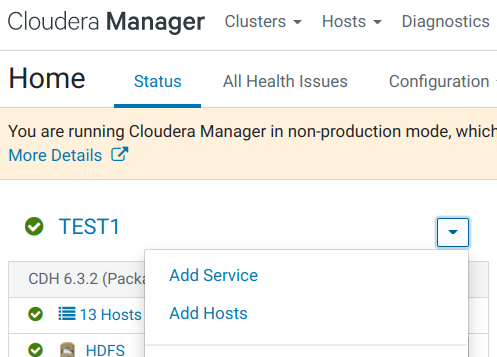
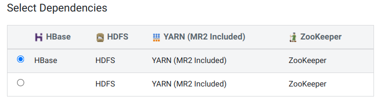
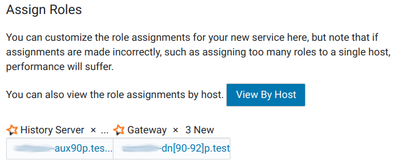
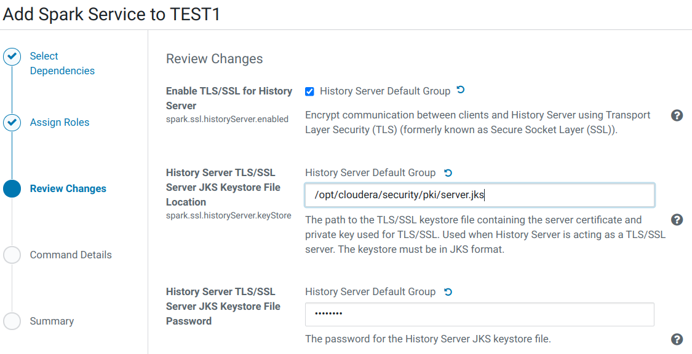
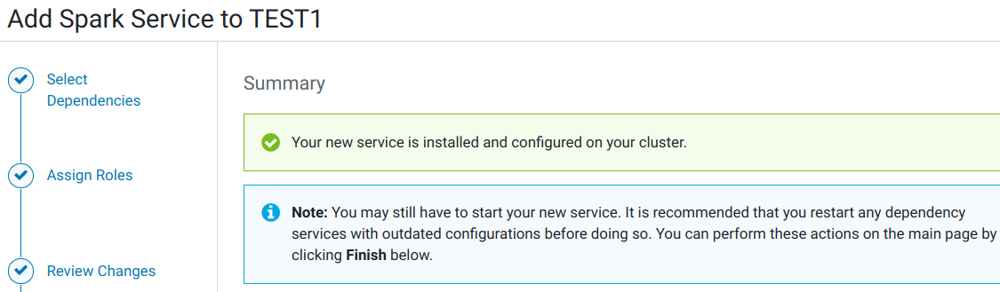
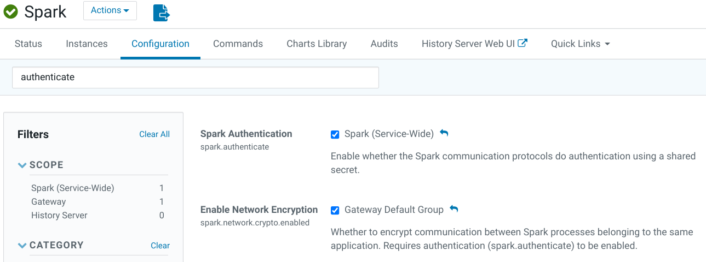
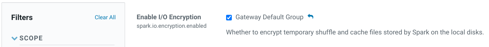
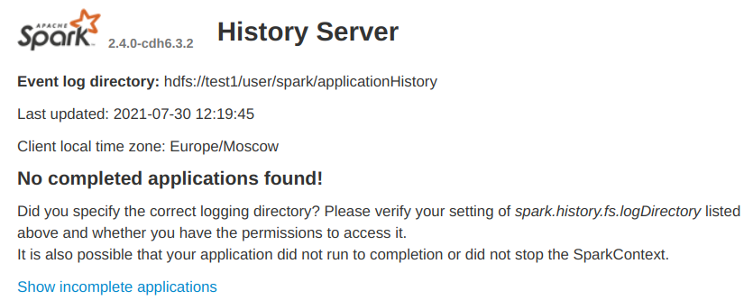

## Использованные материалы
1. [Manually Configuring TLS/SSL Encryption for CDH Services](https://docs.cloudera.com/documentation/enterprise/6/6.3/topics/cm_sg_hadoop_ssl_cm.html)
2. [Spark Encryption](https://docs.cloudera.com/documentation/enterprise/6/6.3/topics/sg_spark_encryption.html)

## 1. Добавление сервиса Spark
1. В консоли Cloudera Manager в меню выбираем 'Add Service':
    <center></center>
2. Выбираем Spark.
3. **Select Dependencies**.
    <center></center>
4. **Assign Roles**.<br>
Распределяем роли. History Server размещаем на одном из дополнительных aux узлов, а шлюзы на dn-узлах и других по необходимости:
    <center></center>
5. Сразу включаем TLS для роли.
<table>
<tr>
<th>Property</th><th>Value</th><th>Description</th>
</tr>
<tr>
<td><b>Enable TLS/SSL for History Server</b><br>
<i>spark.ssl.historyServer.enabled</i>
</td>
<td><span style="color: blue">☑</span></td>
<td>Encrypt communication between clients and History Server using Transport Layer Security (TLS) (formerly known as Secure Socket Layer (SSL)).</td>
</tr>
<tr>
<td><b>History Server TLS/SSL Server JKS Keystore File Location</b><br>
<i>spark.ssl.historyServer.keyStore</i>
</td>
<td><span style="color: blue"><code>/opt/cloudera/security/pki/server.jks</code></span></td>
<td>The path to the TLS/SSL keystore file containing the server certificate and private key used for TLS/SSL. Used when History Server is acting as a TLS/SSL server. The keystore must be in JKS format.</td>
</tr>
<tr>
<td><b>History Server TLS/SSL Server JKS Keystore File Password</b><br>
</td>
<td>По умолчанию: <span style="color: blue">changeit</span>.</td>
<td>The password for the History Server JKS keystore file.</td>
</tr>
</table>

<center></center>

6. Наблюдаем добавление Spark'а.
7. Заключительный шаг мастера:
    <center></center>
8. Перезапускаем все зависимые сервисы по приглашению Cloudera Manager Console.

## 2. Перенастройка размещения log'ов
1. В настройках Spark, используя фильтр '/var/', изменяем только следующие параметры, добавляя имя каталога '/data' вместо '/var':
<table>
<tr>
<th>Property</th><th>Value</th><th>Description</th>
</tr>
<tr>
<td><b>GATEWAY Lineage Log Directory</b><br>
<i> </i>
</td>
<td><code><span style="color: blue">/data</span>/log/spark/lineage</code></td>
<td>The directory in which GATEWAY lineage log files are written. If changed from the default, Cloudera Manager will not be able to provide lineage information without restarting the Cloudera Manager Agent(s).</td>
</tr>
<tr>
<td><b>History Server Log Directory</b><br>
<i>log_dir</i>
</td>
<td><code><span style="color: blue">/data</span>/log/spark</code></td>
<td>The log directory for log files of the role History Server.</td>
</tr>
</table>

2. Нажимаем **Save Changes**.

## 3. Включение Spark Encryption
1. В настройках службы Spark изменяем следующие параметры:
<table>
<tr>
<th>Property</th><th>Value</th><th>Description</th>
</tr>
<tr>
<td><b>Spark Authentication</b><br>
<i>spark.authenticate</i>
</td>
<td><span style="color: blue">☑</span><span style="color: gray"> Spark (Service-Wide)</span></td>
<td>Enable whether the Spark communication protocols do authentication using a shared secret.</td>
</tr>
<tr>
<td><b>Enable Network Encryption</b><br>
<i>spark.network.crypto.enabled</i>
</td>
<td><span style="color: blue">☑</span><span style="color: gray"> Spark (Service-Wide)</span></td>
<td>Whether to encrypt communication between Spark processes belonging to the same application. Requires authentication (spark.authenticate) to be enabled.</td>
</tr>
<tr>
<td><b>Enable I/O Encryption</b><br>
<i>spark.io.encryption.enabled</i>
</td>
<td><span style="color: blue">☑</span><span style="color: gray"> Spark (Service-Wide)</span></td>
<td>Whether to encrypt temporary shuffle and cache files stored by Spark on the local disks.</td>
</tr>
</table>
<center></center>
<center></center>

2. Нажимаем **Save Changes**.

## Включение аутентификации в Spark
1. В настройках службы Spark изменяем следующие параметры:
<table>
<tr>
<th>Property</th><th>Value</th><th>Description</th>
</tr>
<tr>
<td><b>Enable User Authentication</b><br>
<i>history_server_spnego_enabled</i>
</td>
<td><span style="color: blue">☑</span></td>
<td>Enables user authentication using SPNEGO (requires Kerberos), and enables access control to application history data.</td>
</tr>
<tr>
<td><b>Admin Users</b><br>
<i>spark.history.ui.admin.acls</i>
</td>
<td><span style="color: blue">eugene,user_da</span></td>
<td>Comma-separated list of users who can view all applications when authentication is enabled.</td>
</tr>
</table>

2. Нажимаем **Save Changes**.

## Установка зависимостей
Этот шаг был ещё на этапе добавления сервиса в кластер, так что можно проигнорировать.

1. В настройках службы Spark изменяем следующие параметры:
<table>
<tr>
<th>Property</th><th>Value</th><th>Description</th>
</tr>
<tr>
<td><b>HBase Service</b><br>
</td>
<td><span style="color: blue">◉&nbsp;HBase</span></td>
<td>Name of the HBase service that this Spark service instance depends on</td>
</tr>
</table>

2. Нажимаем **Save Changes**.
3. Перезапускаем все зависимые сервисы по приглашению Cloudera Manager Console.

## Выполнение тестовой задачи
На машине с ролью 'Spark Gateway' находим местоположение тестового jar-файла и выполняем его:
```bash
$ find /usr -name spark-examples*
  /usr/lib/spark/examples/jars/spark-examples_2.11-2.4.0-cdh6.3.2.jar

$ spark-submit --class org.apache.spark.examples.SparkPi  \
  --master yarn \
  --num-executors 1 \
  --driver-memory 512m \
  --executor-memory 512m  \
  --executor-cores 1 \
  /usr/lib/spark/examples/jars/spark-examples_2.11-2.4.0-cdh6.3.2.jar
```

Получаем результат:
```
22/04/07 17:45:33 INFO scheduler.DAGScheduler: Job 0 finished: reduce at SparkPi.scala:38, took 1.461295 s
Pi is roughly 3.146675733378667
```

Проверяем её отображение в Spark History, Yarn History, ...

## Встреченные проблемы
### На странице Spark History Server не отображается история задач
#### Симптомы
1. На странице Spark History Server не видно история задач:
    <center></center>
2. В логе Spark History Server видны записи:
    ```
    FsHistoryProvider
    Unable to read log hdfs://test1/user/spark/applicationHistory/application_1627632320956_0001
    org.apache.hadoop.security.AccessControlException: Permission denied: user=spark, access=READ, inode="/user/spark/applicationHistory/application_1627632320956_0001":eugene:spark:-rwxrwx---
    ...
    Caused by: org.apache.hadoop.ipc.RemoteException(org.apache.hadoop.security.AccessControlException): Permission denied: user=spark, access=READ, inode="/user/spark/applicationHistory/application_1627632320956_0001":eugene:spark:-rwxrwx---
    ```

#### Сбор данных
1. Проверяем права на каталоги:
    ```
    drwxr-xr-x   - hdfs supergroup      0     2021-07-21 16:37 /
    drwxr-xr-x   - hdfs supergroup      0     2021-07-12 16:09 /user
    drwxr-x--x   - spark spark          0     2021-07-02 16:22 /user/spark
    drwxrwxrwt   - spark spark          0     2021-07-30 11:15 /user/spark/applicationHistory
    -rwxrwx---   3 eugene spark     45499     2021-07-30 11:15 /user/spark/applicationHistory/application_1627632320956_0001
    ```

2. Исходные файлы истории создаются в `/tmp/logs/eugene/logs`. После чего копируются в `/user/spark/applicationHistory`:
    ```
    $ hdfs dfs -ls /tmp/logs/eugene/logs
    drwxrwx---   - eugene hadoop          0 2021-07-30 11:15 /tmp/logs/eugene/logs/application_1627632320956_0001
    ```

#### Лечение
