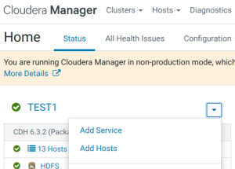
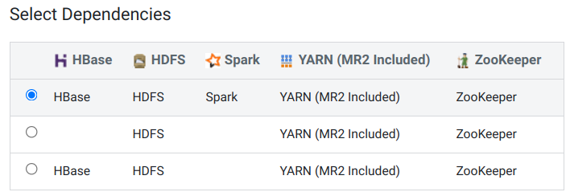
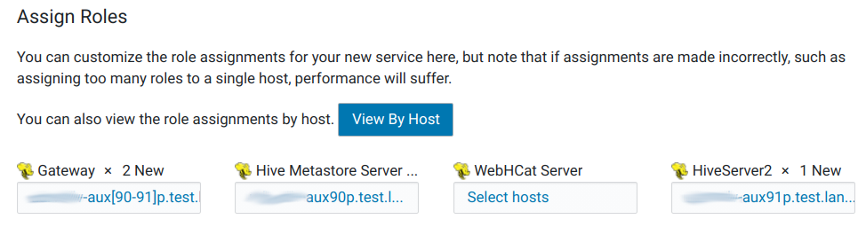
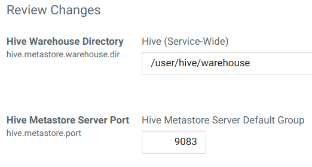
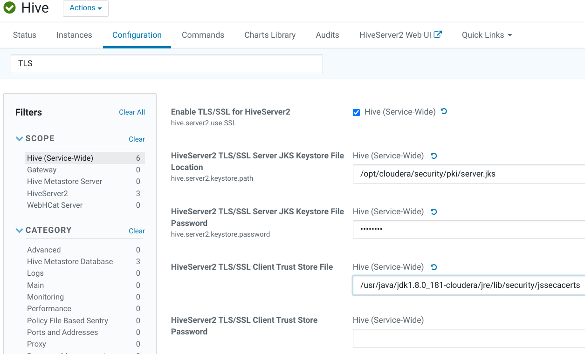

## Использованные материалы
1. [Manually Configuring TLS/SSL Encryption for CDH Services](https://docs.cloudera.com/documentation/enterprise/6/6.3/topics/cm_sg_hadoop_ssl_cm.html)

## Добавление сервиса Hive
1. В консоли Cloudera Manager в меню выбираем 'Add Service':
    

2. Выбираем Hive.
3. Выбираем зависимости:
    

4. Распределяем роли. Рекомендуется устанавливать роли Hive Gateway на узлы кластера с ролью Spark Gateway, иначе Hive-таблицы не будут доступны для Spark'а.
    

5. Настройка базы данных. Так как сейчас используется встроенная база данных, то никаких дополнительных действий не производим, а нажимаем кнопку 'Test Connection'.
6. На шаге Review Changes ничего не меняем:
    

7. Наблюдаем запуск ролей. Здесь может произойти ошибка из-за отсутствия роли Spark Gateway на машине с устанавливаемой ролью HiveServer2. Решается в параллельном окне Cloudera Manager'а, где добавляем роль Spark Gateway на требуемый узел.
8. Визард успешно закончен.

## Перенастройка размещения log'ов
1. В настройках Hive, используя категорию 'Logs' и фильтр '/var/log', изменяем следующие параметры, добавляя '/data' вместо '/var':
<table>
<tr>
<th>Property</th><th>Value</th><th>Description</th>
</tr>
<tr>
<td><b>Hive Metastore Server Log Directory</b> 
</td>
<td><code>/data/log/hive</code></td>
<td>Directory where Hive Metastore Server will place its log files.</td>
</tr>
<tr>
<td><b>HiveServer2 Log Directory</b> 
</td>
<td><code>/data/log/hive</code></td>
<td>Directory where HiveServer2 will place its log files.</td>
</tr>
<tr>
<td><b>HiveServer2 Operations Log Directory</b> 
<i>hive.server2.logging.operation.log.location</i>
</td>
<td><code>/data/log/hive/operation_logs</code></td>
<td>Top level directory where operation logs are temporarily stored if Enable HiveServer2 Operations Logging is true. Logs are stored in session and operation level subdirectories under this location and are removed on completion of operation.</td>
</tr>
<tr>
<td><b>WebHCat Server Log Directory</b> 
</td>
<td><code>/data/log/hcatalog</code></td>
<td>WebHCat Server Log Directory</td>
</tr>
</table>

2. Нажимаем **Save Changes**.

## Настройка зашифрованного обмена данными между HiveServer2 и клиентскими драйверами
В CDH 5.5 и более поздних версиях шифрование между HiveServer2 и его клиентами было отделено от аутентификации Kerberos. (До CDH 5.5 шифрование SASL QOP для клиентских драйверов JDBC требовало соединений, аутентифицированных Kerberos.) Отсоединение процесса аутентификации от процесса шифрования транспортного уровня означает, что HiveServer2 может поддерживать два разных подхода к шифрованию между службой и ее клиентами ( Beeline, JDBC / ODBC) независимо от того, используется ли Kerberos для аутентификации, а именно:
- [SASL](https://www.ietf.org/rfc/rfc2222.txt)
- [TLS / SSL](https://tools.ietf.org/html/rfc5246)

В отличие от TLS, шифрование SASL QOP не требует сертификатов и направлено на защиту основных соединений Hadoop RPC. Однако SASL QOP может иметь проблемы с производительностью при обработке больших объемов данных, поэтому в зависимости от ваших шаблонов использования TLS может быть лучшим выбором. См. Следующие темы для получения подробной информации о настройке служб и клиентов HiveServer2 для TLS и SASL QOP шифрования.

Здесь мы рассмотрим настройку только TLS шифрования.

### 3.1. Настройка TLS шифрования для HiveServer2
To configure TLS for Hive in clusters managed by Cloudera Manager:

1. В настройках службы Hive, используя регион 'Security', изменяем следующие параметры:

<table style="border:1px;">
<tr>
<th>Property</th><th>Value</th><th>Description</th>
</tr>
<tr>
<td><b>Enable TLS/SSL for HiveServer2</b> 
</td>
<td>☑</td>
<td>Click the checkbox to enable encrypted client-server communications between HiveServer2 and its clients using TLS/SSL.</td>
</tr>
<tr>
<td><b>HiveServer2 TLS/SSL Server JKS Keystore File Location</b> 
</td>
<td><code>/opt/cloudera/security/pki/server.jks</code></td>
<td>Enter the path to the Java keystore on the host system. For example:/opt/cloudera/security/pki/server-name-server.jks</td>
</tr>
<tr>
<td><b>HiveServer2 TLS/SSL Server JKS Keystore File Password</b> 
</td>
<td>По умолчанию: changeit.</td>
<td>Enter the password for the keystore that was passed at the Java keytool command-line when the key and keystore were created. As detailed in <a href="https://docs.cloudera.com/documentation/enterprise/6/6.3/topics/how_to_obtain_server_certs_tls.html#gen_server_key_csr_obtain_certs" target="_blank">How To Obtain and Deploy Keys and Certificates for TLS/SSL</a>, the password for the keystore must be the same as the password for the key.</td>
</tr>
<tr>
<td><b>HiveServer2 TLS/SSL Client Trust Store File</b> 
 
В Cloudera мануале: 
HiveServer2 TLS/SSL Certificate Trust Store File
</td>
<td><code>/usr/java/jdk1.8.0_181-cloudera/jre/lib/security/jssecacerts</code></td>
<td>Enter the path to the Java trust store on the host system. Cloudera clusters are typically configured to <a href="https://docs.cloudera.com/documentation/enterprise/6/6.3/topics/how_to_obtain_server_certs_tls.html#create_trust_store" target="_blank">use the alternative trust store, jssecacerts</a>, set up at $JAVA_HOME/jre/lib/security/jssecacerts.</td>
</tr>
</table>

Поле ввода для пароля хранилища доверенных сертификатов оставлено пустым, поскольку хранилище доверенных сертификатов обычно не защищено паролем - оно не содержит ключей, только общедоступные сертификаты, которые помогают установить цепочку доверия во время установления связи TLS. Кроме того, для чтения доверенного хранилища пароль не требуется.

2. Нажимаем **Save Changes**.
3. Перезапускаем все зависимые сервисы по приглашению Cloudera Manager Console.

## Настройка аутентификации
{}
На данный момент, включена kerberos-аутентификация для Hive. Следующие изменения в параметрах Hive добавят к kerberos-аутентификации LDAP-аутентификацию.

Starting with CDH 5.7 and later, clusters running LDAP-enabled HiveServer2 deployments also accept Kerberos authentication.
{}

1. В настройках службы Hive, используя регион 'Security', изменяем следующие параметры:
<table>
<tr>
<th>Property</th><th>Value</th><th>Description</th>
</tr>
<tr>
<td><b>Enable LDAP Authentication</b>
</td>
<td>☑</td>
<td>When checked, LDAP-based authentication for users is enabled.</td>
</tr>
<tr>
<td><b>LDAP URL</b> 
<i>hive.server2.authentication.ldap.url</i>
</td>
<td><code>ldaps://dev-ipa03p.test.lan ldaps://dev-ipa02p.test.lan ldaps://dev-ipa01p.test.lan</code> 
Три адреса разделённые пробелами в одну строку.</td>
<td>The URL of the LDAP server. The URL must be prefixed with ldap:// or ldaps://. The URL can optionally specify a custom port, for example: ldaps://ldap_server.example.com:1636. Note that usernames and passwords will be transmitted in the clear unless either an ldaps:// URL is used, or "Enable LDAP TLS" is turned on (where available). Also note that encryption must be in use between the client and this service for the same reason.

For more detail on the LDAP URL format, see RFC 2255 . A space-separated list of URLs can be entered; in this case the URLs will each be tried in turn until one replies.</td>
</tr>
<tr>
<td><b>LDAP BaseDN</b> 
<i>hive.server2.authentication.ldap.baseDN</i>
</td>
<td>cn=users,cn=accounts,dc=test,dc=lan</td>
<td>This parameter is useful when authenticating against a non-Active Directory server, such as OpenLDAP. When set, this parameter is used to convert the username into the LDAP Distinguished Name (DN), so that the resulting DN looks like uid=username,<this parameter>. For example, if this parameter is set to "ou=People,dc=cloudera,dc=com", and the username passed in is "mike", the resulting authentication passed to the LDAP server look like "uid=mike,ou=People,dc=cloudera,dc=com". This parameter is mutually exclusive with Active Directory Domain.</td>
</tr>
</table>

2. Чуть ниже наблюдаем параметры, которые отвечают за TLS для WEB-интерфейса Hive.

## Включение TLS для WEB-интерфейса Hive
После включения TLS, пропадёт неавторизованный доступ к WEB-интерфейсу Hive. Для доступа потребуется kerberos-тикет и настроенный Web-браузер для использования Kerberos в определённом домене.

1. В настройках службы Hive, используя регион 'Security', изменяем следующие параметры:
<table>
<tr>
<th>Property</th><th>Value</th><th>Description</th>
</tr>
<tr>
<td><b>Enable TLS/SSL for HiveServer2 WebUI</b> 
<i>hive.server2.webui.use.ssl</i>
</td>
<td>☑</td>
<td>Encrypt communication between clients and HiveServer2 WebUI using Transport Layer Security (TLS) (formerly known as Secure Socket Layer (SSL)).</td>
</tr>
<tr>
<td><b>HiveServer2 WebUI TLS/SSL Server JKS Keystore File Password</b> 
<i>hive.server2.webui.keystore.password</i>
</td>
<td>По умолчанию: changeit.</td>
<td>The password for the HiveServer2 WebUI JKS keystore file.</td>
</tr>
<tr>
<td><b>HiveServer2 WebUI TLS/SSL Server JKS Keystore File Location</b> 
<i>hive.server2.webui.keystore.path</i>
</td>
<td><code>/opt/cloudera/security/pki/server.jks</code></td>
<td>The path to the TLS/SSL keystore file containing the server certificate and private key used for TLS/SSL. Used when HiveServer2 WebUI is acting as a TLS/SSL server. The keystore must be in JKS format.</td>
</tr>
</table>

2. Нажимаем **Save Changes**.

## Отключение доступа внешних приложений к Hive Metastore (Disabling Hive CLI etc.)
[Before Enabling the Sentry Service](https://docs.cloudera.com/documentation/enterprise/6/6.3/topics/sg_sentry_service_config.html#concept_z5b_42s_p4__section_lvc_4g4_rp)

Setting this parameter blocks access to the Hive metastore for non-service users. This effectively disables Hive CLI, Spark, and Sqoop applications from interacting with the Hive service. These application will still run, but after setting this parameter as described here, they will no longer be able to access the Hive metastore and all Hive queries will fail. Users running these tools must be part of the hive, hue, or sentry groups to access the Hive service. To allow greater access, additional user groups must be added to the proxy list.

1. В настройках службы Hive, используя фильтр 'Hive Metastore Access Control and Proxy User Groups Override', изменяем следующие параметры:
<table>
<tr>
<th>Property</th><th>Value</th><th>Description</th>
</tr>
<tr>
<td><b>Hive Metastore Access Control and Proxy User Groups Override</b> 
<i>hadoop.proxyuser.hive.groups</i>
</td>
<td>
<ul>
<li>hive</li>
<li>hue</li>
<li>sentry</li>
</ul>

Могут быть указаны дополнительные пользовательские группы.

</td>
<td>This configuration <b>overrides</b> the value set for Hive Proxy User Groups configuration in HDFS service for use by Hive Metastore Server. Specify a comma-delimited list of groups that you want to <b>allow access to Hive Metastore metadata</b> and allow the Hive user to impersonate. A value of '*' allows all groups. The default value of empty inherits the value set for Hive Proxy User Groups configuration in the HDFS service.</td>
</tr>
</table>

2. Нажимаем **Save Changes**.
3. Перезапускаем все зависимые сервисы по приглашению Cloudera Manager Console.
