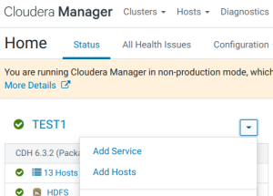

## Добавление сервиса Sentry
1. В консоли Cloudera Manager в меню выбираем 'Add Service':
    <center></center>
2. Выбираем **Sentry**.
3. Распределяем роли:
    <center></center>
4. Настройка базы данных. Так как сейчас используется встроенная база данных, то никаких дополнительных действий не производим, а нажимаем кнопку 'Test Connection'.
5. Наблюдаем запуск ролей.
6. Визард успешно закончен.

## Перенастройка размещения log'ов
1. В настройках Sentry, используя категорию 'Logs', изменяем следующие параметры, добавляя '/data' вместо '/var':
<table>
<tr>
<th>Property</th><th>Value</th><th>Description</th>
</tr>
<tr>
<td><b>Sentry Server Log Directory</b>
</td>
<td><span style="color: blue"><code>/data/log/sentry</code></span></td>
<td>Directory where Sentry Server will place its log files.</td>
</tr>
</table>

2. Нажимаем **Save Changes**.

## Создание группы администраторов Sentry
1. Добавление группы во FreeIPA. Так как установка кластера производится с машины, домен которой отличен от домена настраиваемых машин, то вновь используем ansible:
    ```bash
    $ ADM_USER='eugene' \
    ADM_PASS='JL9d]qtw$p=2=M2K=~z?|EU,1' \
    CL_NAME="TEST1"          # UPPERCASE \
    CL_NAME_L=${CL_NAME,,}   # lowercase

    $ ansible mgm -i cluster.inv -m shell -a "echo '${ADM_PASS}' | kinit ${ADM_USER} && \
      ipa group-add --desc='Sentry admins for cluster ${CL_NAME}' ${CL_NAME_L}_sentry_admins"

    10.15.120.140 | CHANGED | rc=0 >>
    Password for admin@TEST.LAN:
    ---------------------------------
    Added group "test1_sentry_admins"
    ---------------------------------
      Group name: test1_sentry_admins
      Description: Sentry admins for cluster TEST1
      GID: 1262100013
    ```

2. В настройках службы Sentry изменяем следующие параметры:
<table>
<tr>
<th>Property</th><th>Value</th><th>Description</th>
</tr>
<tr>
<td><b>Admin Groups</b><br>
<i>sentry.service.admin.group</i>
</td>
<td>Добавляем созданную ранее группу:<br>
<span style="color: blue">test1_sentry_admins</span></td>
<td>If an end user is in one of these admin groups, that user has administrative privileges on the Sentry Server.</td>
</tr>
<tr>
<td><b>Allowed Connecting Users</b><br>
<i>sentry.service.allow.connect</i>
</td>
<td><span style="color: blue">nifantevea<br>
user_da</span><br>
Сюда добавляем УЗ (обязательно являющиеся участниками группы 'test1_sentry_admins'), из-под которых будет производиться администрирование Sentry с помощью CLI.</td>
<td>List of users allowed to connect to the Sentry Server. These are usually service users such as hive and impala, and the list does not usually need to include end users.</td>
</tr>
</table>

<center></center>
<center></center>

3. Нажимаем **Save Changes**.

## Настройка других сервисов для работы с Sentry
### Hive
<table>
<tr>
<th>Property</th><th>Value</th><th>Description</th>
</tr>
<tr>
<td><b>Enable Stored Notifications in Database</b>
</td>
<td><span style="color: blue">☑</span></td>
<td>Enable stored notifications of metadata changes. When enabled, each metadata change will be stored in NOTIFICATION_LOG.</td>
</tr>
<tr>
<td><b>HiveServer2 Enable Impersonation</b><br>
<i>hive.server2.enable.doAs</i>
</td>
<td><span style="color: blue">☐</span></td>
<td>HiveServer2 will impersonate the beeline client user when talking to other services such as MapReduce and HDFS.</td>
</tr>
<tr>
<td><b>Sentry Service</b>
</td>
<td><span style="color: blue">◉&nbsp;Sentry</span>
○&nbsp;None</td>
<td>Name of the Sentry service that this Hive service instance depends on. If selected, Hive uses this Sentry service to look up authorization privileges. Before enabling Sentry, read the requirements and configuration steps in Setting Up The Sentry Service.</td>
</tr>
</table>

2. Нажимаем **Save Changes**.

### HDFS
{}
Включение синхронизации доступно только после добавления сервиса Hive.
{}

1. В настройках HDFS изменяем следующие параметры:
<table>
<tr>
<th>Property</th><th>Value</th><th>Description</th>
</tr>
<tr>
<td><b>Sentry Service</b>
</td>
<td><span style="color: blue">◉&nbsp;Sentry</span><br>
○&nbsp;None</td>
<td>Name of the Sentry service that this Hue service instance depends on</td>
</tr>
</table>

2. Нажимаем **Save Changes**.
3. Перезапускаем все зависимые сервисы по приглашению Cloudera Manager Console.

{}
"Отключение доступа внешних приложений к Hive Metastore" описал на странице ["18. Hive. Установка и настройка"](/manuals/bigdata/ustanovka-cloudera-cdh-6.3.2-s-tls-i-kerberos-na-osnove-freeipa/hive-ustanovka-i-nastroyka/#%D0%BE%D1%82%D0%BA%D0%BB%D1%8E%D1%87%D0%B5%D0%BD%D0%B8%D0%B5-%D0%B4%D0%BE%D1%81%D1%82%D1%83%D0%BF%D0%B0-%D0%B2%D0%BD%D0%B5%D1%88%D0%BD%D0%B8%D1%85-%D0%BF%D1%80%D0%B8%D0%BB%D0%BE%D0%B6%D0%B5%D0%BD%D0%B8%D0%B9-%D0%BA-hive-metastore-disabling-hive-cli-etc).
{}
