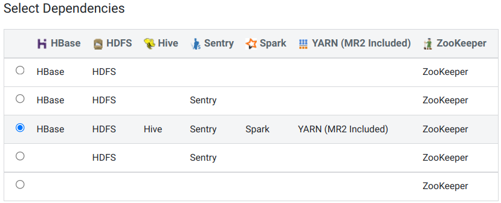
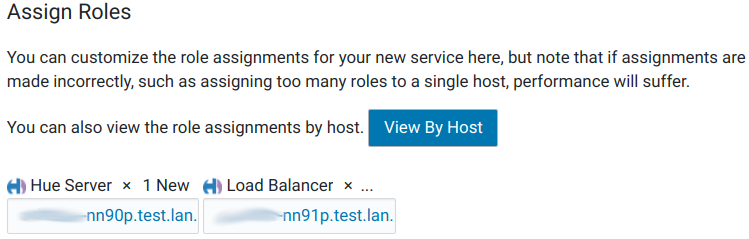

## Использованные материалы
1. [Manually Configuring TLS/SSL Encryption for CDH Services](https://docs.cloudera.com/documentation/enterprise/6/6.3/topics/cm_sg_hadoop_ssl_cm.html)

## Добавление сервиса Hue
1. В консоли Cloudera Manager в меню выбираем 'Add Service':
  <center></center>
2. Выбираем Hue.
3. Выбираем зависимости:
  <center></center>
4. Распределяем роли:
  <center></center>
5. Настройка базы данных. Так как сейчас используется встроенная база данных, то никаких дополнительных действий не производим, а нажимаем кнопку 'Test Connection'.
6. Наблюдаем запуск ролей.
7. Визард успешно закончен.

## Перенастройка размещения log'ов
1. В настройках Hue, используя категорию 'Logs', изменяем следующие параметры, добавляя '/data' вместо '/var':
  <table>
  <tr>
  <th>Property</th><th>Value</th><th>Description</th>
  </tr>
  <tr>
  <td><b>Hue Server Log Directory</b>
  </td>
  <td><span style="color: blue"><code>/data/log/hue</code></span></td>
  <td>Directory where Hue Server will place its log files.</td>
  </tr>
  <tr>
  <td><b>Kerberos Ticket Renewer Log Directory</b>
  </td>
  <td><span style="color: blue"><code>/data/log/hue</code></span></td>
  <td>Directory where Kerberos Ticket Renewer will place its log files.</td>
  </tr>
  <tr>
  <td><b>Hue Load Balancer Log Directory</b>
  </td>
  <td><span style="color: blue"><code>/data/log/hue-httpd</code></span></td>
  <td>Directory where Hue Load Balancer will place its log files.</td>
  </tr>
  </table>

2. Нажимаем **Save Changes**.

## 4. Настройка TLS для Hue
### Hue как клиент TLS
Hue действует как клиент TLS при взаимодействии с другими сервисами, такими как Hadoop, HBase, Oozie и Amazon S3. Это означает, что Hue должен аутентифицировать демонов HDFS, MapReduce, YARN, сервер HBase Thrift и т. Д. Для этого Hue нужны цепочки сертификатов их хостов в своем хранилище доверенных сертификатов.
Хранилище доверенных сертификатов Hue - это один файл PEM, содержащий корень CA и все промежуточные сертификаты для аутентификации сертификата, установленного на каждом сервере с поддержкой TLS. На этих серверах размещаются различные службы, с которыми общается Hue.
Примечание. Сертификат зависит от хоста. Он подписан центром сертификации (CA) и сообщает запрашивающему клиенту (Hue), что «этот хост» является тем же, что представлен открытым ключом хоста. Hue использует цепочку подписывающих центров в своем хранилище доверенных сертификатов для проверки ЦС, подписавшего сертификат хоста.

### 4.1. Создание Hue Truststore File в PEM формате
Сертификаты сервера хранятся в формате JKS и должны быть преобразованы в PEM. Чтобы создать хранилище доверенных сертификатов Hue, извлеките каждый сертификат из хранилища ключей с помощью keytool, преобразуйте его в формат PEM с помощью openssl и добавьте в хранилище доверенных сертификатов.

Этот шаг уже выполнен при раскидывании ключей и сертификатов с помощью ансибль-плэйбука  cloudera_setup_tls.

### 4.2. Enabling TLS/SSL for the Hue Server with Cloudera Manager
1. В настройках службы Hue, используя фильтр 'TLS', изменяем следующие параметры:
<table>
<tr>
<th>Property</th><th>Value</th><th>Description</th>
</tr>
<tr>
<td><b>Enable LDAP TLS</b><br>
<i>use_start_tls</i>
</td>
<td><span style="color: blue">☐</span></td>
<td>If true, attempts to establish a TLS (Transport Layer Security) connection with an LDAP server that was specified with ldap://. Not required when using an LDAP URL with prefix ldaps://, because that already specifies TLS. This option is also known as "Use StartTLS".</td>
</tr>
<tr>
<td><b>Enable TLS/SSL for Hue</b>
</td>
<td><span style="color: blue">☑</span></td>
<td>Encrypt communication between clients and Hue with TLS/SSL.</td>
</tr>
<tr>
<td><b>Hue TLS/SSL Server Certificate File (PEM Format)</b><br>
<i>ssl_certificate</i>
</td>
<td><span style="color: blue"><code>/opt/cloudera/security/pki/agent.pem</code></span></td>
<td>Path to TLS/SSL certificate on host running Hue web server.</td>
</tr>
<tr>
<td><b>Hue TLS/SSL Server Private Key File (PEM Format)</b><br>
<i>ssl_private_key</i>
</td>
<td><span style="color: blue"><code>/opt/cloudera/security/pki/agent.key</code></span></td>
<td>Path to TLS/SSL private key on host running Hue web server.</td>
</tr>
<tr>
<td><b>Hue TLS/SSL Private Key Password</b><br>
<i>ssl_password</i>
</td>
<td>По умолчанию: <span style="color: blue">changeit</span>.</td>
<td>Password for private key in Hue TLS/SSL Server Certificate and Private Key file.</td>
</tr>
</table>

You can also store ssl_password more securely in a script and set this parameter instead:

`ssl_password_script=<your_hue_passwords_script.sh>`

For more, see [Storing Hue Passwords in a Script](https://docs.cloudera.com/documentation/enterprise/6/6.3/topics/cm_sg_ssl_hue.html#concept_l3k_xg4_c5).

To apply this configuration property to other role groups as needed, edit the value for the appropriate role group. See [Modifying Configuration Properties Using Cloudera Manager](https://docs.cloudera.com/documentation/enterprise/6/6.3/topics/cm_mc_mod_configs.html#cmug_topic_5_3).

2. Нажимаем **Save Changes**.

### 4.3. Настройка Hue, как TLS клиент
1. В настройках службы Hue изменяем следующий параметр:
<table>
<tr>
<th>Property</th><th>Value</th><th>Description</th>
</tr>
<tr>
<td><b>Hue TLS/SSL Server CA Certificate (PEM Format)</b><br>
<i>ssl_cacerts</i>
</td>
<td><span style="color: blue">/etc/ipa/ca.crt</span></td>
<td>The path to the TLS/SSL file containing the certificate of the certificate authority (CA) and any intermediate certificates used to sign the server certificate. Used when Hue is acting as a TLS/SSL server. The certificate file must be in PEM format, and is usually created by concatenating all of the appropriate root and intermediate certificates.</td>
</tr>
</table>

2. Нажимаем **Save Changes**.

### 4.4. Включение TLS для Hue Load Balancer
Чтобы настроить балансировщик нагрузки Hue для использования HTTPS или для работы в качестве сервера TLS, вам потребуется самозаверяющий сертификат SSL и файл закрытого ключа. Если файл закрытого ключа защищен паролем, вам необходимо настроить Hue Load Balancer на использование соответствующего ключевого пароля.

1. В настройках службы Hue изменяем следующие параметры:
<table>
<tr>
<th>Property</th><th>Value</th><th>Description</th>
</tr>
<tr>
<td><b>Hue Load Balancer TLS/SSL Server Certificate File (PEM Format)</b><br>
<i>SSLCertificateFile</i>
</td>
<td><span style="color: blue"><code>/opt/cloudera/security/pki/agent.pem</code></span></td>
<td>The path to the TLS/SSL file containing the server certificate key used for TLS/SSL. Used when Hue Load Balancer is acting as a TLS/SSL server. The certificate file must be in PEM format.</td>
</tr>
<tr>
<td><b>Hue Load Balancer TLS/SSL Server Private Key File (PEM Format)</b><br>
<i>SSLCertificateKeyFile</i>
</td>
<td><span style="color: blue"><code>/opt/cloudera/security/pki/agent.key</code></span></td>
<td>The path to the TLS/SSL file containing the private key used for TLS/SSL. Used when Hue Load Balancer is acting as a TLS/SSL server. The certificate file must be in PEM format.</td>
</tr>
<tr>
<td><b>Hue Load Balancer TLS/SSL Server SSLPassPhraseDialog</b><br>
<i>SSLPassPhraseDialog</i>
</td>
<td><span style="color: blue"><code>/opt/cloudera/security/pki/tls_key.pass</code></span></td>
<td>The path to the file containing the passphrase used to encrypt the private key of the Hue Load Balancer server. The passphrase file is optional.</td>
</tr>
</table>

2. Нажимаем **Save Changes**.

### 4.5. Включение TLS связи Hue с HiveServer2
В CDH 5.5.x и более поздних версиях HiveServer2 по умолчанию включен для связи TLS.

Чтобы обеспечить связь между Hue и HiveServer2 с использованием TLS, Hue требуется сертификат Hive и цепочка сертификатов.

1. В настройках службы Hue ищем "Hue Service Advanced Configuration Snippet (Safety Valve) for hue_safety_valve.ini" и добавляем сюда:
    ```
    [beeswax]
      [[ssl]]
        #enabled=true # Эта опция отсутствует в исходниках
        # https://github.com/cloudera/hue/blob/master/apps/beeswax/src/beeswax/conf.py#L251
        cacerts=/etc/ipa/ca.crt
        validate=true
    ```
2. Нажимаем **Save Changes**.
3. Перезапускаем все зависимые сервисы по приглашению Cloudera Manager Console.

### 4.7. Securing Database Connections using TLS/SSL
Hue использует разных клиентов для внутренней связи с каждой базой данных. Параметры для конкретного клиента, такие как безопасное соединение, можно настроить с помощью Cloudera Manager.

Не понял этот шаг. Позже разберёмся.

## Настройка LDAP-аутентификации в Cloudera Hue
1. В настройках службы Hue изменяем следующие параметры:
<table>
<tr>
<th>Property</th><th>Value</th><th>Description</th>
</tr>
<tr>
<td><b>Hue Service Advanced Configuration Snippet (Safety Valve) for hue_safety_valve.ini</b><br>
</td>
<td><span style="color: blue">
<pre><code>[desktop]
[[ldap]]
sync_groups_on_login=true
[useradmin]
home_dir_permissions=0750
</code></pre>
</span></td>
<td>
Обновление участников локальных групп участниками групп из FreeIPA при попытке входа.

Для новых пользовательских каталогов в HDFS устанавливать режим 750, вместо дефолтного 755.

<span style="color: red">Режим 750 будет препятствовать импорту данных в Hive-таблицу из файла. При импорте  средствами Hue, создаётся каталог /user/eugene/.scratchdir с правами 777, куда копируется файл перед его импортом. Но hive не сможет этот файл прочесть, так как на родительском каталоге установлен режим 750.

И что делать?
</span>
</td>
</tr>
<tr>
<td><b>Hue Server Advanced Configuration Snippet (Safety Valve) for hive-site.xml</b><br>
</td>
<td>
<b>Nama</b>: <span style="color: blue">hive.server2.authentication</span>
<br>
<b>Value</b>: <span style="color: blue">KERBEROS</span><br> (Обязательно (?) заглавными буквами, иначе случалось, что добавление ролей, списки существующих ролей, какая-то ещё информация была недоступна.)
</td>
<td>Иначе при входе в Hue высвечивается ошибка:<br>
{}
Bad status: 3 (PLAIN auth failed: javax.security.sasl.AuthenticationException: Error validating LDAP user [Caused by javax.naming.AuthenticationException: [LDAP: error code 49 - Invalid Credentials]]) (code THRIFTTRANSPORT): TTransportException('Bad status: 3 (PLAIN auth failed: javax.security.sasl.AuthenticationException: Error validating LDAP user [Caused by javax.naming.AuthenticationException: [LDAP: error code 49 - Invalid Credentials]])',)
{}
</td>
</tr>
</table>

2. В настройках службы Hue, используя категорию 'Security', изменяем следующие параметры:
<table>
<tr>
<th>Property</th><th>Value</th><th>Description</th>
</tr>
<tr>
<td><b>Authentication Backend</b><br>
<i>backend</i>
</td>
<td><span style="color: blue">desktop.auth.backend.LdapBackend</span></td>
<td>Mode of authenticating login credentials. Select desktop.auth.backend.LdapBackend to use LDAP to authenticate login credentials. LDAP requires you to also set the LDAP URL, Active Directory Domain, and optionally LDAP certificate if you are using secure LDAP. Select desktop.auth.backend.PamBackend to use PAM to authenticate login credentials.</td>
</tr>
<tr>
<td><b>LDAP URL</b><br>
<i>ldap_url</i>
</td>
<td><span style="color: blue"><code>ldaps://dev-ipa01p.test.lan ldaps://dev-ipa02p.test.lan ldaps://dev-ipa03p.test.lan</code></span><br>
<br>
Адреса IPA разделённые пробелом в одну строку.
</td>
<td>
The URL of the LDAP server. The URL must be prefixed with ldap:// or ldaps://. The URL can optionally specify a custom port, for example: ldaps://ldap_server.example.com:1636. Note that usernames and passwords will be transmitted in the clear unless either an ldaps:// URL is used, or "Enable LDAP TLS" is turned on (where available). Also note that encryption must be in use between the client and this service for the same reason.
<br><br>
For more detail on the LDAP URL format, see RFC 2255 . A space-separated list of URLs can be entered; in this case the URLs will each be tried in turn until one replies.
</td>
</tr>
<tr>
<td><b>LDAP Server CA Certificate</b><br>
<i>ldap_cert</i>
</td>
<td><span style="color: blue"><code>/etc/ipa/ca.crt</code></span></td>
<td>The location on disk of the certificate, in .pem format, used to confirm the authenticity of the LDAP server certificate. This is the Certificate Authority (CA) certificate, and it was used to sign the LDAP server certificate. If not set, all certificates are trusted, which means that an attacker could potentially intercept otherwise encrypted usernames and passwords.</td>
</tr>
<tr>
<td><b>Enable LDAP TLS</b><br>
<i>use_start_tls</i>
</td>
<td><p><span style="color: blue">☐</span></p>
<p>Отключаем StartTLS, так как используем <code>ldaps://</code>.</p>
</td>
<td>If true, attempts to establish a TLS (Transport Layer Security) connection with an LDAP server that was specified with ldap://. Not required when using an LDAP URL with prefix ldaps://, because that already specifies TLS. This option is also known as "Use StartTLS".</td>
</tr>
<tr>
<td><b>LDAP Username Pattern</b><br>
<i>ldap_username_pattern</i>
</td>
<td><span style="color: blue">uid=<username>,cn=users,cn=accounts,dc=test,dc=lan</span></td>
<td>LDAP Username Pattern for use with non-Active Directory LDAP implementations. Must contain the special '<username>' string for replacement during authentication.</td>
</tr>
<tr>
<td><b>Use Search Bind Authentication</b><br>
<i>search_bind_authentication</i>
</td>
<td><span style="color: blue">☑</span></td>
<td>Search Bind Authentication connects to the LDAP server using credentials provided in the 'bind_dn' and 'bind_password' configurations. If these configurations are not set, then an anonymous search is performed.</td>
</tr>
<tr>
<td><b>Create LDAP users on login</b><br>
<i>create_users_on_login</i>
</td>
<td><span style="color: blue">☑</span></td>
<td>Create users in Hue when they try to login with their LDAP credentials. For use when using LdapBackend for Hue authentication.</td>
</tr>
<tr>
<td><b>LDAP Search Base</b><br>
<i>base_dn</i>
</td>
<td><span style="color: blue">cn=accounts,<br>dc=example,dc=org</span></td>
<td>The distinguished name to use as a search base for finding users and groups. This should be similar to 'dc=hadoop,dc=mycompany,dc=com'.</td>
</tr>
<tr>
<td><b>LDAP Bind User Distinguished Name</b><br>
<i>bind_dn</i>
</td>
<td><span style="color: blue">uid=binddn_cluser1,cn=sysaccounts,<br>cn=etc,dc=example,dc=org</span>
<br><br>
<p>В одну строку.</p>
</td>
<td>Distinguished name of the user to bind as. This is used to connect to LDAP/AD for searching user and group information. This may be left blank if the LDAP server supports anonymous binds.</td>
</tr>
<tr>
<td><b>LDAP Bind Password</b><br>
<i>bind_password</i>
</td>
<td><span style="color: blue">**********</span></td>
<td>The password of the bind user.</td>
</tr>
<tr>
<td><b>LDAP Username for Test LDAP Configuration</b><br>
<i>test_ldap_user</i>
</td>
<td><span style="color: blue">eugene</span></td>
<td>An optional user name for validating LDAP user configurations. If a test user name is provided, Hue's LDAP library uses it as a search parameter when running the command, Test Hue LDAP Configuration (under Hue > Actions). For example, (&(objectClass=*)(sAMAccountName=test_ldap_user)). If "*" is provided, then all user attributes are returned. If test user name is not provided then Test Hue LDAP Configuration action will check only LDAP server connectivity.</td>
</tr>
<tr>
<td><b>LDAP Group Name for Test LDAP Configuration</b><br>
<i>test_ldap_group</i>
</td>
<td><span style="color: blue">cluster1_hue_users</span></td>
<td>An optional group name for validating LDAP group configurations. If a test group name is provided, Hue's LDAP library uses it as a search parameter when running the command, Test Hue LDAP Configuration (under Hue > Actions). For example, (&(objectClass=*)(sAMAccountName=test_ldap_group)). If test group name is not provided then Hue LDAP Configuration action will check only LDAP server connectivity.</td>
</tr>
<tr>
<td><b>LDAP User Filter</b><br>
<i>user_filter</i>
</td>
<td><span style="color: blue">(&(objectClass=person)(memberOf=cn=cluster1_hue_*,<br>cn=groups,cn=accounts,dc=example,dc=org))</span>
<br><br>
<p>В одну строку.</p></td>
<td>The base filter for searching for users. For Active Directory, this is typically '(objectClass=user)'.
<br><br>
В Hue будут допущены только участники групп cluster1_hue_admins, cluster1_hue_users, etc. В том числе участники вложенных групп.</td>
</tr>
<tr>
<td><b>LDAP Username Attribute</b><br>
<i>user_name_attr</i>
</td>
<td><span style="color: blue">uid</span></td>
<td>The username attribute in the LDAP schema. For Active Directory, this is typically 'sAMAccountName'.</td>
</tr>
<tr>
<td><b>LDAP Group Filter</b><br>
<i>group_filter</i>
</td>
<td><span style="color: blue">(objectClass=ipausergroup)</span></td>
<td>Base filter for searching for groups. For Active Directory, this is typically '(objectClass=group)'.</td>
</tr>
<tr>
<td><b>LDAP Group Name Attribute</b><br>
<i>group_name_attr</i>
</td>
<td><span style="color: blue">cn</span></td>
<td>The group name attribute in the LDAP schema. For Active Directory, this is typically 'cn'.</td>
</tr>
<tr>
<td><b>LDAP Group Membership Attribute</b><br>
<i>group_member_attr</i>
</td>
<td><span style="color: blue">member</span></td>
<td>The attribute of the group object that identifies the members of the group. For Active Directory, this is typically 'member'.</td>
</tr>
</table>

3. Нажимаем **Save Changes**.
4. Перезапускаем все зависимые сервисы по приглашению Cloudera Manager Console.
5. Во FreeIPA создаём необходимые группы для аутентификации в Hue. Авторизация к таблицам будет обеспечиваться с помощью Sentry, через WEB UI сервиса Hue.
    ```bash
    $ ADM_USER='eugene' \
    ADM_PASS='JL9d]qtw$p=2=M2K=~z?|EU,1' \
    CL_NAME="CLUSTER1"          # UPPERCASE \
    CL_NAME_L=${CL_NAME,,}   # lowercase

    $ ansible mgm -i cluster.inv -m shell -a "echo '${ADM_PASS}' | kinit ${ADM_USER} && \
      ipa group-add --desc='Hue admins for cluster ${CL_NAME}' ${CL_NAME_L}_hue_admins"

    $ ansible mgm -i cluster.inv -m shell -a "echo '${ADM_PASS}' | kinit ${ADM_USER} && \
      ipa group-add --desc='Hue users for cluster ${CL_NAME}' ${CL_NAME_L}_hue_users"
    ```
6. Создаём администраторскую роль:
    ```bash
    ```

## Enabling SPNEGO as an Authentication Backend for Hue (обычно не требуется)
1. In Cloudera Manager, set the authentication backend to SpnegoDjangoBackend.
    - Go to the Cloudera Manager Admin Console. From the Clusters tab, select the Hue service.
    - Click the Configuration tab.
    - Select Scope > Service-Wide.
    - Select Category > Security.
    - Locate the Authentication Backend property and select desktop.auth.backend.SpnegoDjangoBackend.
    - Click Save Changes.
2. Restart the Hue service.

Так как Hue был переключён на SPNEGO, то я зашёл в его WEB UI без пароля через Firefox и Chromium, настроенными на kerberos. В HDFS появилась папка /home/eugene.

{}
При переключении Hue на SPNEGO высветилась ошибка:

<span style="color: red">General Error(s)</span>

- <span style="color: red">Role is missing Kerberos keytab. Go to the Kerberos Credentials page and click the Generate Missing Credentials button.</span>

После перезапуска кластера, всё в норме.
{}

## Прочие настройки
1. В настройках службы Hue изменяем следующие параметры:
<table>
<tr>
<th>Property</th><th>Value</th><th>Description</th>
</tr>
<tr>
<td><b>Time Zone</b><br>
<i>time_zone</i>
</td>
<td>
<span style="color: gray">Hue (Service-Wide)</span>
<br>
<span style="color: blue">Europe/Moscow</span></td>
<td>Time zone name.</td>
</tr>
<tr>
<td><b>Top Banner Custom HTML</b><br>
<i>banner_top_html</i>
</td>
<td><span style="color: blue">
<xmp><div align="center"><h1>TEST1 cluster</h1></div></xmp></span>
</td>
<td>An optional, custom one-line HTML code to display as a banner on top of all Hue Server web pages. Useful in displaying cluster identity of the Hue Server.</td>
</tr>
<tr>
<td><b>Secret Key</b><br>
<i>secret_key</i>
</td>
<td>
<span style="color: gray">Hue Server Default Group</span><br>
<span style="color: blue">2]<,OXrfT!7AxuYw}\g0LZz#@76J%t</span>
<br><br>
Рекомендованная длина этой строки из случайных смиволов равна от 30 до 60.
</td>
<td>Random string used for secure hashing in the session store.</td>
</tr>
</table>
