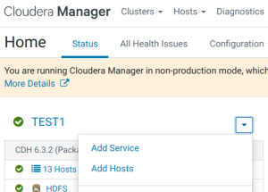
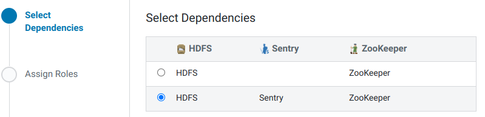
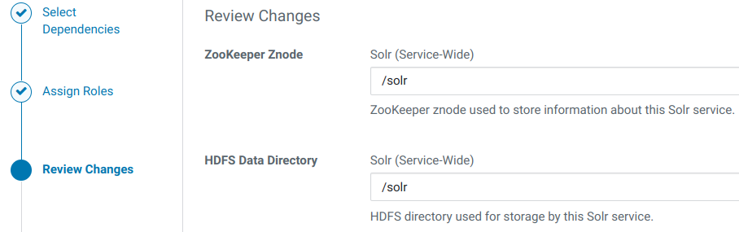
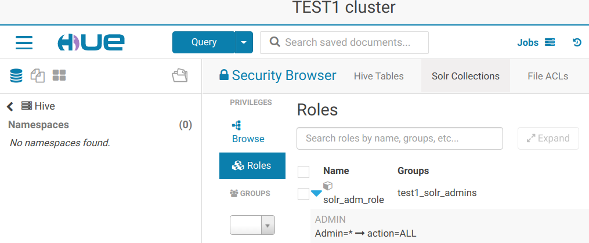
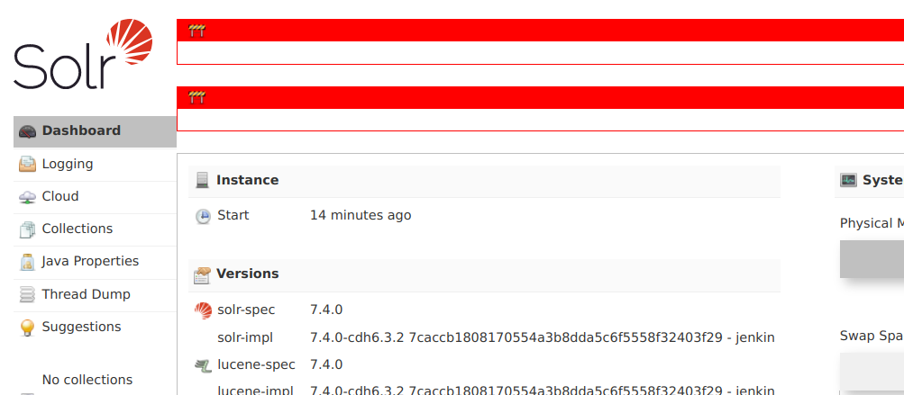

## 1. Использованные материалы
1. [Configuring TLS/SSL for Solr](https://docs.cloudera.com/documentation/enterprise/latest/topics/sg_solr_ssl.html)
2. [Cloudera Search Authentication](https://docs.cloudera.com/documentation/enterprise/6/6.3/topics/cdh_sg_search_security.html)

## 2. Добавление сервиса Solr
1. В консоли Cloudera Manager в меню выбираем 'Add Service':
    <center></center>
2. Выбираем Solr.
3. Выбираем зависимости:
    <center></center>
4. Распределяем роли.
5. Пути к каталогам оставляем без изменений:
    <center></center>
6. Наблюдаем запуск ролей.
7. Визард успешно закончен.

## 3. Перенастройка размещения log'ов
1. В настройках Solr, используя категорию 'Logs', изменяем следующие параметры, добавляя '/data' вместо '/var':
<table>
<tr>
<th>Property</th><th>Value</th><th>Description</th>
</tr>
<tr>
<td><b>Solr Server Log Directory</b>
</td>
<td><span style="color: blue">/data/log/solr</span></td>
<td>Directory where Solr Server will place its log files.</td>
</tr>
</table>

2.Нажимаем **Save Changes**.

## 4. Настройка TLS
Так как на данный момент в сертификатах хостов отсутствует SAN с ip-адресами узлов, то в дополнение к TLS-параметрам добавляем отключение проверки имён узлов.

{}
https://solr.apache.org/guide/6_6/enabling-ssl.html

If you created your SSL key without all DNS names/IP addresses on which Solr nodes will run, you can tell Solr to skip hostname verification for inter-Solr-node communications by setting the `solr.ssl.checkPeerName` system property to false:<br>
*nix command

bin/solr -cloud -s cloud/node1 -z localhost:2181 -p 8984 -Dsolr.ssl.checkPeerName=false
{}

1. В настройках Solr, используя фильтр 'TLS', изменяем следующие параметры:
<table>
<tr>
<th>Property</th><th>Value</th><th>Description</th>
</tr>
<tr>
<td><b>Enable TLS/SSL for Solr</b>
</td>
<td><span style="color: blue">☑</span></td>
<td>Encrypt communication between clients and Solr using Transport Layer Security (TLS) (formerly known as Secure Socket Layer (SSL)). Additional manual steps must be performed; see <a href="https://docs.cloudera.com/documentation/enterprise/6/6.3/topics/cdh_sg_search_security.html" target="_blank">Enabling TLS/SSL for Solr</a>.</td>
</tr>
<tr>
<td><b>Solr TLS/SSL Server JKS Keystore File Location</b>
</td>
<td><span style="color: blue">/opt/cloudera/security/pki/server.jks</span></td>
<td> </td>
</tr>
<tr>
<td><b>Solr TLS/SSL Server JKS Keystore File Password</b><br>
<i>solr.jetty.keystore.password,</i>
</td>
<td>По умолчанию: <span style="color: blue">changeit</span>.</td>
<td>The password for the Solr JKS keystore file.</td>
</tr>
<tr>
<td><b>Solr TLS/SSL Client Trust Store File</b>
</td>
<td><span style="color: blue">/usr/java/jdk1.8.0_181-cloudera/jre/lib/security/jssecacerts</span></td>
<td>The location on disk of the trust store, in .jks format, used to confirm the authenticity of TLS/SSL servers that Solr might connect to. This is used when Solr is the client in a TLS/SSL connection. This trust store must contain the certificate(s) used to sign the service(s) connected to. If this parameter is not provided, the default list of well-known certificate authorities is used instead.</td>
</tr>
<tr>
<td><b>Solr TLS/SSL Client Trust Store Password</b><br>
<i>solr.jetty.truststore.password,</i>
</td>
<td>По умолчанию: <span style="color: blue">changeit</span>.</td>
<td>The password for the Solr TLS/SSL Certificate Trust Store File. This password is not required to access the trust store; this field can be left blank. This password provides optional integrity checking of the file. The contents of trust stores are certificates, and certificates are public information.</td>
</tr>
</table>

2. Отключаем проверку имён узлов:
<table>
<tr>
<th>Property</th><th>Value</th><th>Description</th>
</tr>
<tr>
<td><b>Java Configuration Options for Solr Server</b>
</td>
<td><p>{{JAVA_GC_ARGS}} <span style="color: blue">-Dsolr.ssl.checkPeerName=false</span></p><br>
<p>Одной строкой!</p>
</td>
<td>These arguments will be passed as part of the Java command line. Commonly, garbage collection flags, PermGen, or extra debugging flags would be passed here. Note: When CM version is 6.3.0 or greater, {{JAVA_GC_ARGS}} will be replaced by JVM Garbage Collection arguments based on the runtime Java JVM version.</td>
</tr>
</table>

3. Нажимаем **Save Changes**.

{}
При наличии установленных сервисов Key-Value Store Indexer и/или Flume требуется настройка этих сервисов, как указано в использованном материале по ссылке номер один.
{}

## 5. Настройка аутентификации
Solr поддерживает одновременную аутентификацию по протоколам Kerberos и LDAP.

1. В настройках Solr, используя категорию 'Security', изменяем следующие параметры:
<table>
<tr>
<th>Property</th><th>Value</th><th>Description</th>
</tr>
<tr>
<td><b>Solr Secure Authentication</b>
</td>
<td>○&nbsp;simple<br>
<span style="color: blue">◉&nbsp;kerberos</span></td>
<td>Choose the authentication mechanism used by Solr.</td>
</tr>
<tr>
<td><b>Enable LDAP Authentication</b>
</td>
<td><span style="color: blue">☑</span></td>
<td>When checked, LDAP-based authentication for users is enabled.</td>
</tr>
<tr>
<td><b>LDAP URL</b>
</td>
<td><p><span style="color: blue">ldaps://dev-ipa03p.test.lan ldaps://dev-ipa02p.test.lan ldaps://dev-ipa01p.test.lan</span></p>
<p>Три адреса разделённые проблелами. <span style="color: red">Но это не работает (см. п.8.1.). Поэтому указываем один сервер.</span></p>
</td>
<td><p>The URL of the LDAP server. The URL must be prefixed with ldap:// or ldaps://. The URL can optionally specify a custom port, for example: ldaps://ldap_server.example.com:1636. Note that usernames and passwords will be transmitted in the clear unless either an ldaps:// URL is used, or "Enable LDAP TLS" is turned on (where available). Also note that encryption must be in use between the client and this service for the same reason.</p>

<p>For more detail on the LDAP URL format, see RFC 2255 . A space-separated list of URLs can be entered; in this case the URLs will each be tried in turn until one replies.</p></td>
</tr>
<tr>
<td><b>LDAP BaseDN</b>
</td>
<td><span style="color: blue">cn=users,cn=accounts,dc=test,dc=lan</span></td>
<td>This parameter is useful when authenticating against a non-Active Directory server, such as OpenLDAP. When set, this parameter is used to convert the username into the LDAP Distinguished Name (DN), so that the resulting DN looks like uid=username,<this parameter>. For example, if this parameter is set to "ou=People,dc=cloudera,dc=com", and the username passed in is "mike", the resulting authentication passed to the LDAP server look like "uid=mike,ou=People,dc=cloudera,dc=com". This parameter is mutually exclusive with Active Directory Domain.</td>
</tr>
<tr>
<td><b>Enable LDAP TLS</b>
</td>
<td><span style="color: blue">☐</span></td>
<td>If true, attempts to establish a TLS (Transport Layer Security) connection with an LDAP server that was specified with ldap://. Not required when using an LDAP URL with prefix ldaps://, because that already specifies TLS. This option is also known as "Use StartTLS".</td>
</tr>
</table>

2. Нажимаем **Save Changes**.
3. Перезапускаем все зависимые сервисы по приглашению Cloudera Manager Console.

## Настройка зависмости Hue от Solr
1. В настройках Hue изменяем следующие параметры:
<table>
<tr>
<th>Property</th><th>Value</th><th>Description</th>
</tr>
<tr>
<td><b>Solr Service</b>
</td>
<td><span style="color: blue">◉&nbsp;Solr</span><br>
○&nbsp;none</td>
<td>Name of the Solr service that this Hue service instance depends on</td>
</tr>
</table>

2. Нажимаем **Save Changes**.
3. Перезапускаем все зависимые сервисы по приглашению Cloudera Manager Console.

## 6. Утилита управления solrctl
<details><summary>solrctl</summary>

```
usage: /usr/lib/solr/bin/solrctl.sh [options] command [command-arg] [command [command-arg]] ...

Options:
    --solr solr_uri
    --zk   zk_ensemble
    --jaas jaas.conf
    --help
    --quiet
    --debug Prints error output of calls
    --trace Prints executed commands

Commands:
    init        [--force]

    instancedir [--generate path [-schemaless]]
                [--create name path]
                [--update name path]
                [--get name path]
                [--delete name]
                [--list]  

    config      [--create name baseConfig [-p name=value]...]
                [--delete name]

    collection  [--create name -s <numShards>
                              [-a Create collection with autoAddReplicas=true]
                              [-c <collection.configName>]
                              [-r <replicationFactor>]
                              [-m <maxShardsPerNode>]
                              [-n <createNodeSet>]]
                [--delete name]
                [--reload name]
                [--stat name]
                [--deletedocs name]
                [--list]
                [--create-snapshot snapshotName -c <collectionName>]
                [--delete-snapshot snapshotName -c <collectionName>]
                [--list-snapshots collectionName]
                [--describe-snapshot snapshotName -c <collectionName>]
                [--prepare-snapshot-export snapshotName -c <collectionName> -d <destDir> [-p <fsPathPrefix>]]
                [--export-snapshot snapshotName [-s <sourceDir>] [-c <collectionName>] -d <destDir>]
                [--restore name  -b <backupName> -l <backupLocation> -i <requestId>
                                 [-a Restore collection with autoAddReplicas=true]
                                 [-c <collection.configName>]
                                 [-r <replicationFactor>]
                                 [-m <maxShardsPerNode>]]
                [--request-status requestId]

    core        [--create name [-p name=value]...]
                [--reload name]
                [--unload name]
                [--status name]

    cluster     [--get-solrxml file]
                [--put-solrxml file]
                [--set-property name value]
                [--remove-property name]
                [--get-clusterstate file]
                [--get-securityconf file]
                [--put-securityconf file]

    sentry      [--create-role role]
                [--drop-role role]
                [--add-role-group role group]
                [--delete-role-group role group]
                [--list-roles [-g group]]
                [--grant-privilege role privilege]
                [--revoke-privilege role privilege]
                [--list-privileges role]
                [--convert-policy-file file [-dry-run]]
```

</details>

## 7. Настройка аутентификации и авторизации
### Примеры solrctl sentry --grant-privilege
entity name specified for the admin entity type. Valid names are [*, collections, cores, security, metrics, autoscaling]

1. `solrctl sentry --grant-privilege adm_role 'admin=*->action=*'`
2. `solrctl sentry --grant-privilege adm_role 'admin=collections→action=*'`
    - `solrctl sentry --grant-privilege adm_role 'collection=*->action=*`
3. `solrctl sentry --grant-privilege adm_role 'admin=cores->action=*'`
4. `solrctl sentry --grant-privilege adm_role 'admin=security->action=*'`
5. `solrctl sentry --grant-privilege adm_role 'admin=metrics->action=*'`
6. `solrctl sentry --grant-privilege adm_role 'admin=autoscaling→action=*'`

### Пример solrctl sentry --revoke-privilege
1. `solrctl sentry --revoke-privilege adm_role 'admin=collections->action=*`

### Создание для Solr роли с привилегиями администратора
- [Using Solr with the Sentry Service](https://docs.cloudera.com/documentation/enterprise/6/6.3/topics/search_sentry.html#concept_m2p_knc_3w)
- [Authorization Privilege Model for Cloudera Search](https://docs.cloudera.com/documentation/enterprise/6/6.3/topics/sentry_privileges_solr.html)

1. Добавляем во FreeIPA группу test1_solr_admins:
    ```bash
    [eugene@localhost hadoop]$ ansible mgm -i cluster.inv -m shell -a \
    "echo 'PassWord' | kinit admin && ipa group-add --desc='Solr admins for cluster TEST1' test1_solr_admins"

    10.5.120.140 | CHANGED | rc=0 >>
    Password for admin@TEST.LAN:
    ---------------------------
    Added group "temp1_solr_admins"
    ---------------------------
      Group name: temp1_solr_admins
      Description: Solr admins for cluster TEST1
      GID: 1262100017
    ```
2. На машине с ролью Solr Gateway выполняем:
    ```bash
    [eugene@localhost ~]$ kinit
    Password for eugene@TEST.LAN:

    [eugene@localhost ~]$ solrctl sentry --list-roles
    21/07/27 16:42:39 INFO thrift.SentryGenericServiceClientFactory: Using UserGroupInformation authentication
    21/07/27 16:42:39 INFO transport.SentryTransportPool: Creating pool for dev-mgm90p.test.lan:8038 with default port 8038
    21/07/27 16:42:39 INFO transport.SentryTransportPool: Adding endpoint dev-mgm90p.test.lan:8038
    21/07/27 16:42:39 INFO transport.SentryTransportPool: Connection pooling is enabled

    [eugene@localhost ~]$ solrctl sentry --create-role solradm_role
    ...

    [eugene@localhost ~]$ solrctl sentry --list-roles
    ...
    solradm_role

    [eugene@localhost ~]$ solrctl sentry --add-role-group solradm_role test1_solr_admins
    ...

    [eugene@localhost ~]$ solrctl sentry --grant-privilege solradm_role 'admin=*->action=*'
    ...

    [eugene@localhost ~]$ solrctl sentry --grant-privilege solradm_role 'collection=*->action=*'
    ...

    [eugene@localhost ~]$ solrctl sentry --grant-privilege solradm_role 'config=*->action=*'
    ```
3. В Hue наблюдаем только что созданную роль:
    <center></center>

## 8. Тюнинг
### Включение кэширования для запросов в Sentry
https://docs.cloudera.com/documentation/enterprise/6/6.3/topics/search_sentry.html#concept_qwr_vvh_hbb

1. В настройках Solr изменяем следующие параметры:
<table>
<tr>
<th>Property</th><th>Value</th><th>Description</th>
</tr>
<tr>
<td><b>Solr Service Advanced Configuration Snippet (Safety Valve) for sentry-site.xml</b>
</td>
<td>
<p><b>Name</b>:&nbsp;<span style="color: blue">sentry.provider.backend.generic.cache.enabled</span><br>
<b>Value</b>:&nbsp;<span style="color: blue">true</span><br>
<b>Description</b>:</p>

<p><b>Name</b>:&nbsp;<span style="color: blue">sentry.provider.backend.generic.cache.ttl.ms</span><br>
<b>Value</b>:&nbsp;<span style="color: blue">30000</span><br>
<b>Description</b>:</p>
</td>
<td>For advanced use only, a string to be inserted into sentry-site.xml. Applies to configurations of all roles in this service except client configuration.</td>
</tr>
</table>

2. Нажимаем **Save Changes**.

## 9. Замеченные проблемы
### 9.1. Error: Could not find or load main class ldaps:..dev-ipa02p.test.lan
#### Симптомы
При первом перезапуске сервиса высветилась ошибка:

*** [WARN] *** Your open file limit is currently 32768. It should be set to 65000 to avoid operational disruption.
<details><summary>stdout...</summary>

```
Thu Jul 22 16:39:28 MSK 2021
JAVA_HOME=/usr/java/jdk1.8.0_181-cloudera
using 6 as CDH_VERSION
CONF_DIR=/var/run/cloudera-scm-agent/process/1383-solr-SOLR_SERVER
CMF_CONF_DIR=
Successfully configured urlScheme property for Solr cluster in Zookeeper
Successfully configured security for Solr cluster in Zookeeper
Thu Jul 22 16:39:32 MSK 2021
JAVA_HOME=/usr/java/jdk1.8.0_181-cloudera
using 6 as CDH_VERSION
CONF_DIR=/var/run/cloudera-scm-agent/process/1383-solr-SOLR_SERVER
CMF_CONF_DIR=
Successfully configured urlScheme property for Solr cluster in Zookeeper
Successfully configured security for Solr cluster in Zookeeper
Thu Jul 22 16:39:37 MSK 2021
JAVA_HOME=/usr/java/jdk1.8.0_181-cloudera
using 6 as CDH_VERSION
CONF_DIR=/var/run/cloudera-scm-agent/process/1383-solr-SOLR_SERVER
CMF_CONF_DIR=
Successfully configured urlScheme property for Solr cluster in Zookeeper
Successfully configured security for Solr cluster in Zookeeper
```

</details>

<details><summary>stderr...</summary>

```
+ export SOLR_HDFS_CONFIG=/var/run/cloudera-scm-agent/process/1383-solr-SOLR_SERVER/hadoop-conf
+ SOLR_HDFS_CONFIG=/var/run/cloudera-scm-agent/process/1383-solr-SOLR_SERVER/hadoop-conf
+ export SENTRY_CONF_DIR=/var/run/cloudera-scm-agent/process/1383-solr-SOLR_SERVER/sentry-conf
+ SENTRY_CONF_DIR=/var/run/cloudera-scm-agent/process/1383-solr-SOLR_SERVER/sentry-conf
+ export HDFS_BIN=/usr/lib/hadoop/../../bin/hdfs
+ HDFS_BIN=/usr/lib/hadoop/../../bin/hdfs
+ '[' '' = true ']'
+ '[' true = true ']'
+ export SOLR_AUTHORIZATION_SENTRY_SITE=/var/run/cloudera-scm-agent/process/1383-solr-SOLR_SERVER/sentry-conf/sentry-site.xml
+ SOLR_AUTHORIZATION_SENTRY_SITE=/var/run/cloudera-scm-agent/process/1383-solr-SOLR_SERVER/sentry-conf/sentry-site.xml
+ '[' stop = '' ']'
+ '[' upgrade = '' ']'
+ '[' true = true ']'
+ SOLR_HOME_TMP=/var/lib/solr
+ export SOLR_HOME=/usr/lib/solr
+ SOLR_HOME=/usr/lib/solr
+ '[' true = true ']'
+ eval /usr/lib/solr/bin/solrctl.sh --zk dev-zk90p.test.lan:2181,dev-zk91p.test.lan:2181,dev-zk92p.test.lan:2181/solr --jaas /var/run/cloudera-scm-agent/process/1383-solr-SOLR_SERVER/jaas.conf cluster --set-property urlScheme https
++ /usr/lib/solr/bin/solrctl.sh --zk dev-zk90p.test.lan:2181,dev-zk91p.test.lan:2181,dev-zk92p.test.lan:2181/solr --jaas /var/run/cloudera-scm-agent/process/1383-solr-SOLR_SERVER/jaas.conf cluster --set-property urlScheme https
+ '[' 0 == 0 ']'
+ echo 'Successfully configured urlScheme property for Solr cluster in Zookeeper'
+ '[' 6 -ge 6 ']'
+ export SOLR_SEC_CONFIG_FILE=/usr/lib/solr/clusterconfig/hadoop_multi_scheme_config.json
+ SOLR_SEC_CONFIG_FILE=/usr/lib/solr/clusterconfig/hadoop_multi_scheme_config.json
+ /usr/lib/solr/bin/zksynctool.sh
+ echo 'Successfully configured security for Solr cluster in Zookeeper'
+ export SOLR_STOP_WAIT=2592000
+ SOLR_STOP_WAIT=2592000
+ export SOLR_HOME=/var/lib/solr
+ SOLR_HOME=/var/lib/solr
+ '[' 6 -lt 6 ']'
+ exec /usr/lib/solr/bin/solrd run
Error: Could not find or load main class ldaps:..dev-ipa02p.test.lan
```

</details>

#### Лечение
Оказалось, что сообщение не является проблемой. Для поиска ошибки необходимо смотреть вывод не stdout, а stderr. В последней строке stderr видно, что при запуске строка с адресами трёх ldap-серверов не читается должным образом. Если указать только один адрес, то Solr запускается нормально.

Предупреждение же 'Your open file limit is currently 32768. It should be set to 65000 to avoid operational disruption.' необходимо лечить другим способом, пока мне непонятным, так как в системе установлены лимиты значительно большие, чем 65000.

### 9.2. WARN SolrClientNodeStateProvider could not get tags from node dev-hbr90p.test.lan:8985_solr
#### Симптомы
В логах Solr-сервера наблюдаются повторяющиеся сообщения:

WARN SolrClientNodeStateProvider could not get tags from node dev-hbr90p.test.lan:8985_solr

<details><summary>log...</summary>

```
12:41:59.411 PMINFOCollectionsHandlerInvoked Collection Action :clusterstatus with params doAs=solr&action=CLUSTERSTATUS&wt=json and sendToOCPQueue=true
12:41:59.412 PMINFOHttpSolrCall[admin] webapp=null path=/admin/collections params={doAs=solr&action=CLUSTERSTATUS&wt=json} status=0 QTime=1
12:42:04.473 PMINFOHttpSolrCall[admin] webapp=null path=/admin/metrics params={} status=0 QTime=8
12:42:04.534 PMINFOHttpSolrCall[admin] webapp=null path=/admin/cores params={action=STATUS&wt=json} status=0 QTime=0
12:42:25.937 PMWARNSolrClientNodeStateProvidercould not get tags from node dev-hbr90p.test.lan:8985_solr
java.lang.ClassCastException: [B cannot be cast to java.lang.String
    at org.apache.http.conn.ssl.DefaultHostnameVerifier.getSubjectAltNames(DefaultHostnameVerifier.java:309)
    at org.apache.http.conn.ssl.DefaultHostnameVerifier.verify(DefaultHostnameVerifier.java:112)
    at org.apache.http.conn.ssl.DefaultHostnameVerifier.verify(DefaultHostnameVerifier.java:99)
    at org.apache.http.conn.ssl.SSLConnectionSocketFactory.verifyHostname(SSLConnectionSocketFactory.java:463)
    at org.apache.http.conn.ssl.SSLConnectionSocketFactory.createLayeredSocket(SSLConnectionSocketFactory.java:397)
    at org.apache.http.conn.ssl.SSLConnectionSocketFactory.connectSocket(SSLConnectionSocketFactory.java:355)
    at org.apache.http.impl.conn.DefaultHttpClientConnectionOperator.connect(DefaultHttpClientConnectionOperator.java:142)
    at org.apache.http.impl.conn.PoolingHttpClientConnectionManager.connect(PoolingHttpClientConnectionManager.java:359)
    at org.apache.http.impl.execchain.MainClientExec.establishRoute(MainClientExec.java:381)
    at org.apache.http.impl.execchain.MainClientExec.execute(MainClientExec.java:237)
    at org.apache.http.impl.execchain.ProtocolExec.execute(ProtocolExec.java:185)
    at org.apache.http.impl.execchain.RetryExec.execute(RetryExec.java:89)
    at org.apache.http.impl.execchain.RedirectExec.execute(RedirectExec.java:111)
    at org.apache.http.impl.client.InternalHttpClient.doExecute(InternalHttpClient.java:185)
    at org.apache.http.impl.client.CloseableHttpClient.execute(CloseableHttpClient.java:83)
    at org.apache.http.impl.client.CloseableHttpClient.execute(CloseableHttpClient.java:56)
    at org.apache.solr.client.solrj.impl.HttpSolrClient.executeMethod(HttpSolrClient.java:542)
    at org.apache.solr.client.solrj.impl.HttpSolrClient.request(HttpSolrClient.java:255)
    at org.apache.solr.client.solrj.impl.HttpSolrClient.request(HttpSolrClient.java:244)
    at org.apache.solr.client.solrj.SolrClient.request(SolrClient.java:1219)
    at org.apache.solr.client.solrj.impl.SolrClientNodeStateProvider$ClientSnitchCtx.invoke(SolrClientNodeStateProvider.java:292)
    at org.apache.solr.client.solrj.impl.SolrClientNodeStateProvider.fetchMetrics(SolrClientNodeStateProvider.java:150)
    at org.apache.solr.client.solrj.impl.SolrClientNodeStateProvider$AutoScalingSnitch.getRemoteInfo(SolrClientNodeStateProvider.java:199)
    at org.apache.solr.common.cloud.rule.ImplicitSnitch.getTags(ImplicitSnitch.java:76)
    at org.apache.solr.client.solrj.impl.SolrClientNodeStateProvider.getNodeValues(SolrClientNodeStateProvider.java:111)
    at org.apache.solr.handler.admin.MetricsHistoryHandler.collectGlobalMetrics(MetricsHistoryHandler.java:498)
    at org.apache.solr.handler.admin.MetricsHistoryHandler.collectMetrics(MetricsHistoryHandler.java:371)
    at org.apache.solr.handler.admin.MetricsHistoryHandler.lambda$new$0(MetricsHistoryHandler.java:231)
    at java.util.concurrent.Executors$RunnableAdapter.call(Executors.java:511)
    at java.util.concurrent.FutureTask.runAndReset(FutureTask.java:308)
    at java.util.concurrent.ScheduledThreadPoolExecutor$ScheduledFutureTask.access$301(ScheduledThreadPoolExecutor.java:180)
    at java.util.concurrent.ScheduledThreadPoolExecutor$ScheduledFutureTask.run(ScheduledThreadPoolExecutor.java:294)
    at java.util.concurrent.ThreadPoolExecutor.runWorker(ThreadPoolExecutor.java:1149)
    at java.util.concurrent.ThreadPoolExecutor$Worker.run(ThreadPoolExecutor.java:624)
    at java.lang.Thread.run(Thread.java:748)
```

</details>

#### Лечение
После установки второго Solr-сервера и перезапуска сервиса, ошибки в логах временно пропали, но вновь появились через несколько часов. Отключение Sentry не помогает.

### 9.3. 401 Authentication required HTTP/1.1
#### Симптомы
В Web UI наблюдаем красные рамки:
    <center></center>

Невозможно добавление коллекции и т.п.

В логах Solr-сервера, при уровне логгирования DEBUG, можно найти записи:
```
3:38:29.476 PM DEBUG HttpChannel
COMMIT for /solr/admin/metrics on HttpChannelOverHttp@36e7dd24{r=1,c=true,a=DISPATCHED,uri=https://dev-dn91p.test.lan:8985/solr/admin/metrics}
401 Authentication required HTTP/1.1
Connection: close
WWW-Authenticate: Negotiate
Set-Cookie: hadoop.auth=; Secure; HttpOnly
Cache-Control: must-revalidate,no-cache,no-store
Content-Type: text/html;charset=iso-8859-1
```

#### Лечение
Отключить или настроить Sentry.

{}
Необходимо дополнить.
{}
