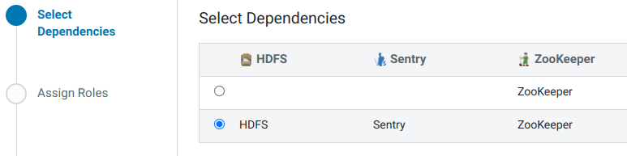

2021-07-23

## Добавление сервиса Kafka
1. В консоли Cloudera Manager в меню выбираем 'Add Service':
    

2. Выбираем Kafka.
3. Выбираем зависимости:
    

4. Распределяем роли с некоторыми условиями:
    - Из-за особенностей работы, которая приводит к высокой утилизации ресурсов системы, под Kafka Brokers лучше выделить отдельные хосты. Чрезвычайно не рекомендуется размещать Kafka на ZooKeeper-узлах.
5. Изменяем настройки:
<table>
  <tr>
    <th>#</th><th>Property</th><th>Value</th><th>Description</th>
  </tr>
  <tr>
    <td><i>1.</i></td>
    <td><b>ZooKeeper Root</b> 
    <i>zookeeper.chroot</i>
    </td>
    <td>/kafka</td>
    <td>The znode in ZooKeeper used as a root for this Kafka cluster.</td>
  </tr>
  <tr>
    <td><i>2.</i></td>
    <td><b>Enable Kerberos Authentication</b> 
    <i>kerberos.auth.enable</i>
    </td>
    <td>☑</td>
    <td>Enables Kerberos authentication for this Kafka service.</td>
  </tr>
  <tr>
    <td><i>3.</i></td>
    <td><b>Data Directories</b> 
    <i>log.dirs</i>
    </td>
    <td>/data/kafka/data</td>
    <td>A list of one or more directories in which Kafka data is stored. Each new partition created is placed in the directory that currently has the least amount of partitions. Each directory should be on its own separate drive.</td>
  </tr>
  <tr>
    <td><i>4.</i></td>
    <td><b>Enable TLS/SSL for Kafka Broker</b> 
    <i>ssl_enabled</i>
    </td>
    <td>☑</td>
    <td>Encrypt communication between clients and Kafka Broker using Transport Layer Security (TLS) (formerly known as Secure Socket Layer (SSL)).</td>
  </tr>
  <tr>
    <td><i>5.</i></td>
    <td><b>Kafka Broker TLS/SSL Server JKS Keystore File Location</b> 
    <i>ssl.keystore.location</i>
    </td>
    <td><code>/opt/cloudera/security/pki/server.jks</code></td>
    <td>The path to the TLS/SSL keystore file containing the server certificate and private key used for TLS/SSL. Used when Kafka Broker is acting as a TLS/SSL server. The keystore must be in JKS format.</td>
  </tr>
  <tr>
    <td><i>6.</i></td>
    <td><b>Kafka Broker TLS/SSL Server JKS Keystore File Password</b> 
    <i>ssl.keystore.password.generator</i>
    </td>
    <td>По умолчанию: changeit.</td>
    <td>The password for the Kafka Broker JKS keystore file.</td>
  </tr>
  <tr>
    <td><i>7.</i></td>
    <td><b>Kafka Broker TLS/SSL Server JKS Keystore Key Password</b> 
    <i>ssl.key.password.generator</i>
    </td>
    <td>По умолчанию: changeit.</td>
    <td>The password that protects the private key contained in the JKS keystore used when Kafka Broker is acting as a TLS/SSL server.</td>
  </tr>
  <tr>
    <td><i>8.</i></td>
    <td><b>Kafka Broker TLS/SSL Client Trust Store File</b> 
    <i>ssl.truststore.location</i>
    </td>
    <td><code>/usr/java/jdk1.8.0_181-cloudera/jre/lib/security/jssecacerts</code></td>
    <td>The location on disk of the trust store, in .jks format, used to confirm the authenticity of TLS/SSL servers that Kafka Broker might connect to. This is used when Kafka Broker is the client in a TLS/SSL connection. This trust store must contain the certificate(s) used to sign the service(s) connected to. If this parameter is not provided, the default list of well-known certificate authorities is used instead.</td>
  </tr>
  <tr>
    <td><i>9.</i></td>
    <td><b>Kafka Broker TLS/SSL Client Trust Store Password</b> 
    <i>ssl.truststore.password.generator</i>
    </td>
    <td>По умолчанию: changeit.</td>
    <td>The password for the Kafka Broker TLS/SSL Certificate Trust Store File. This password is not required to access the trust store; this field can be left blank. This password provides optional integrity checking of the file. The contents of trust stores are certificates, and certificates are public information.</td>
  </tr>
  <tr>
    <td><i>10.</i></td>
    <td><b>Enable TLS/SSL for Kafka MirrorMaker</b> 
    <i>ssl_enabled</i>
    </td>
    <td>☑</td>
    <td>Encrypt communication between clients and Kafka MirrorMaker using Transport Layer Security (TLS) (formerly known as Secure Socket Layer (SSL)).</td>
  </tr>
  <tr>
    <td><i>11.</i></td>
    <td><b>Kafka MirrorMaker TLS/SSL Server JKS Keystore File Location</b> 
    <i>ssl.keystore.location</i>
    </td>
    <td><code>/opt/cloudera/security/pki/server.jks</code></td>
    <td>The path to the TLS/SSL keystore file containing the server certificate and private key used for TLS/SSL. Used when Kafka MirrorMaker is acting as a TLS/SSL server. The keystore must be in JKS format.</td>
  </tr>
  <tr>
    <td><i>12.</i></td>
    <td><b>Kafka MirrorMaker TLS/SSL Server JKS Keystore File Password</b> 
    <i>ssl.keystore.password.generator</i>
    </td>
    <td>По умолчанию: changeit.</td>
    <td>The password for the Kafka MirrorMaker JKS keystore file.</td>
  </tr>
  <tr>
    <td><i>13.</i></td>
    <td><b>Kafka MirrorMaker TLS/SSL Server JKS Keystore Key Password</b> 
    <i>ssl.key.password.generator</i>
    </td>
    <td>По умолчанию: changeit.</td>
    <td>The password that protects the private key contained in the JKS keystore used when Kafka MirrorMaker is acting as a TLS/SSL server.</td>
  </tr>
  <tr>
    <td><i>14.</i></td>
    <td><b>Kafka MirrorMaker TLS/SSL Client Trust Store File</b> 
    <i>ssl.truststore.location</i>
    </td>
    <td><code>/usr/java/jdk1.8.0_181-cloudera/jre/lib/security/jssecacerts</code></td>
    <td>The location on disk of the trust store, in .jks format, used to confirm the authenticity of TLS/SSL servers that Kafka MirrorMaker might connect to. This is used when Kafka MirrorMaker is the client in a TLS/SSL connection. This trust store must contain the certificate(s) used to sign the service(s) connected to. If this parameter is not provided, the default list of well-known certificate authorities is used instead.</td>
  </tr>
  <tr>
    <td><i>15.</i></td>
    <td><b>Kafka MirrorMaker TLS/SSL Client Trust Store Password</b> 
    <i>ssl.truststore.password.generator</i>
    </td>
    <td>По умолчанию: changeit.</td>
    <td>The password for the Kafka MirrorMaker TLS/SSL Certificate Trust Store File. This password is not required to access the trust store; this field can be left blank. This password provides optional integrity checking of the file. The contents of trust stores are certificates, and certificates are public information.</td>
  </tr>
</table>

6. Наблюдаем запуск ролей.
7. Визард успешно закончен.

## 3. Перенастройка размещения log'ов
1. В настройках Kafka, используя категорию 'Logs', изменяем следующие параметры, добавляя '/data' вместо '/var':
<table>
  <tr>
    <th>#</th><th>Property</th><th>Value</th><th>Description</th>
  </tr>
  <tr>
    <td><i>1.</i></td>
    <td><b>Kafka Broker Log Directory</b> 
    <i>kafka.log4j.dir</i>
    </td>
    <td><code>/data/log/kafka</code></td>
    <td>The log directory for log files of the role Kafka Broker.</td>
  </tr>
  <tr>
    <td><i>2.</i></td>
    <td><b>Kafka MirrorMaker Log Directory</b> 
    <i>kafka_mirrormaker.log4j.dir</i>
    </td>
    <td><code>/data/log/kafka</code></td>
    <td>The log directory for log files of the role Kafka MirrorMaker.</td>
  </tr>
</table>

2. Нажимаем **Save Changes**.

## 4. Дополнительные настройки
Так как сервера стоят в отдельном VLAN и перехват трафика маловероятен, то выбираем протокол безопасности без шифрования трафика SASL_PLAINTEXT, так как TLS-шифрование является ресурсоёмкой операцией. При существования риска перехвата трафика необходимо выбрать протокол SASL_SSL.
1. В настройках Kafka следующие параметры приводим к указанному виду:
<table>
  <tr>
    <th>#</th><th>Property</th><th>Value</th><th>Description</th>
  </tr>
  <tr>
    <td><i>1.</i></td>
    <td><b>Sentry Service</b></td>
    <td>◉&nbsp;Sentry 
    ○&nbsp;none</td>
    <td>Name of the Sentry service that this Kafka service instance depends on</td>
  </tr>
  <tr>
    <td><i>2.</i></td>
    <td><b>Enable Kerberos Authentication</b> 
      <i>kerberos.auth.enable</i>
    </td>
    <td>☑</td>
    <td>Enables Kerberos authentication for this Kafka service.</td>
  </tr>
  <tr>
    <td><i>3.</i></td>
    <td><b>Enable Sentry Privileges Caching</b> 
    <i>sentry.kafka.caching.enable</i>
    </td>
    <td>☑</td>
    <td>Enables Sentry privilege caching. Only applicable if authorization via Sentry is enabled.</td>
  </tr>
  <tr>
    <td><i>4.</i></td>
    <td><b>Enable Authenticated Communication with the JMX Agent</b> 
    <i>jmx.auth.enabled</i>
    </td>
    <td>☑</td>
    <td>Enables Authenticated Communication with the JMX Agent.</td>
  </tr>
  <tr>
    <td><i>5.</i></td>
    <td><b>Name of User with read-only access to the JMX Agent</b> 
    <i>jmx.monitor.user</i>
    </td>
    <td>Default value: monitorRole</td>
    <td>Specifies the name of the user that has read-only privileges when using password file-based authentication for JMX access. JMX authentication must be enabled for this setting to take effect.</td>
  </tr>
  <tr>
    <td><i>6.</i></td>
    <td><b>Password of User with read-only Access to the JMX agent</b> 
    <i>jmx.monitor.user.passwd</i>
  </td>
    <td>************</td>
    <td>Specifies the password of the user that has read-only privileges when using password file-based authentication for JMX access. JMX authentication must be enabled for this setting to take effect.</td>
  </tr>
  <tr>
    <td><i>7.</i></td>
    <td><b>Name of User with Read-Write Access to the JMX Agent</b> 
    <i>jmx.control.user</i>
    </td>
    <td>Default value: controlRole</td>
    <td>Specifies the name of the user that has read-write privileges when using password file-based authentication for JMX access. JMX authentication must be enabled for this setting to take effect.</td>
  </tr>
  <tr>
    <td><i>8.</i></td>
    <td><b>Password of user with read-write access to the JMX agent</b> 
    <i>jmx.control.user.passwd</i>
    </td>
    <td>************</td>
    <td>Specifies the password of the user that has read-write privileges when using password file-based authentication for JMX access. JMX authentication must be enabled for this setting to take effect.</td>
  </tr>
  <tr>
    <td><i>9.</i></td>
    <td><b>Enable TLS/SSL for Kafka JMX</b> 
    <i>jmx.ssl.enabled</i>
    </td>
    <td>☑</td>
    <td>Encrypt communication between clients and Kafka JMX using Transport Layer Security (TLS) (formerly known as Secure Socket Layer (SSL)).</td>
  </tr>
  <tr>
    <td><i>10.</i></td>
    <td><b>Enable TLS client authentication for JMX port</b> 
    <i>jmx.ssl.client.auth.enabled</i>
    </td>
    <td>☑</td>
    <td>If enabled, a valid client certificate must be presented by the JMX client in order to connect to the JMX port. Ensure that the trusted CA certificates are present in either the Kafka JMX TLS/SSL Server Trust Store file or the global trust store.</td>
  </tr>
  <tr>
    <td><i>11.</i></td>
    <td><b>SSL Client Authentication</b> 
    <i>ssl.client.auth</i>
    </td>
    <td>
Kafka Broker Default Group

    ◉&nbsp;none 
    ○&nbsp;required 
    ○&nbsp;requested
    </td>
    <td>Client authentication mode for SSL connections. This configuration has three valid values, "required", "requested" and "none". If set to "required", client authentication is required. If set to "requested", client authentication is requested and clients without certificates can still connect. If set to "none", which is the default value, no client authentication is required.</td>
  </tr>
  <tr>
    <td><i>12.</i></td>
    <td><b>Inter Broker Protocol</b> 
    <i>security.inter.broker.protocol</i>
    </td>
    <td>
Kafka Broker Default Group

    ○&nbsp;INFERRED 
    ○&nbsp;PLAINTEXT 
    ○&nbsp;SSL 
    ◉&nbsp;SASL_PLAINTEXT 
    ○&nbsp;SASL_SSL
    </td>
    <td>Protocol to be used for inter-broker communication. INFERRED uses the same protocol that is configured for external clients.</td>
  </tr>
  <tr>
    <td><i>13.</i></td>
    <td><b>Authenticate Zookeeper Connection</b> 
    <i>authenticate.zookeeper.connection</i>
    </td>
    <td>
Kafka Broker Default Group

    ☑</td>
    <td>Enables authentication of SASL connections with zookeeper, if Kerberos authentication is enabled. It also allows a broker to set SASL ACL on zookeeper nodes, which locks these nodes down so that only a Kafka broker can modify it.</td>
  </tr>
  <tr>
    <td><i>14.</i></td>
    <td>
      <b>Super users</b> 
      <i>super.users</i>
    </td>
    <td>
Kafka Broker Default Group

    kafka 
    nifantevea 
    atlas (на время попытки внедрения Apache Atlas в кластер)</td>
    <td>Users who are allowed to perform any action on the Kafka cluster.</td>
  </tr>
  <tr>
    <td><i>15.</i></td>
    <td>
      <b>Source Kafka Cluster's Security Protocol</b> 
      <i>source.security.protocol</i>
    </td>
    <td>
      
Kafka Broker Default Group

      ○&nbsp;INFERRED 
      ○&nbsp;PLAINTEXT 
      ○&nbsp;SSL 
      ◉&nbsp;SASL_PLAINTEXT 
      ○&nbsp;SASL_SSL
    </td>
    <td>Protocol used for communication with source Kafka cluster.</td>
  </tr>
  <tr>
    <td><i>16.</i></td>
    <td>
      <b>Destination Kafka Cluster's Security Protocol</b> 
      <i>destination.security.protocol</i>
    </td>
    <td>
      
Kafka Broker Default Group

      ○&nbsp;INFERRED 
      ○&nbsp;PLAINTEXT 
      ○&nbsp;SSL 
      ◉&nbsp;SASL_PLAINTEXT 
      ○&nbsp;SASL_SSL
    </td>
    <td>Protocol used for communication with destination Kafka cluster.</td>
  </tr>
  <tr>
    <td><i>17.</i></td>
    <td>
      <b>Source Kafka Cluster's Client Auth</b> 
      <i>source.ssl.client.auth</i>
    </td>
    <td>☑</td>
    <td>Only required if the source Kafka cluster requires client authentication.</td>
  </tr>
  <tr>
    <td><i>18.</i></td>
    <td>
      <b>Destination Kafka Cluster's Client Auth</b> 
      <i>destination.ssl.client.auth</i>
      </td>
      <td>☑</td>
      <td>Only required if destination Kafka cluster requires client authentication.
    </td>
  </tr>
</table>

2. Нажимаем **Save Changes**.
3. Перезапускаем все зависимые сервисы по приглашению Cloudera Manager Console.
