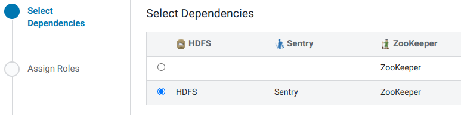
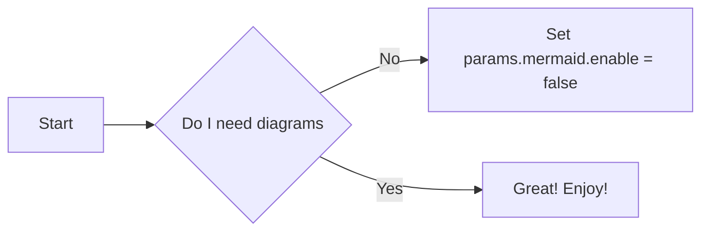
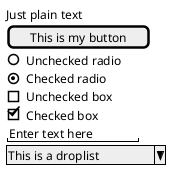

2021-07-23

## Добавление сервиса Kafka
1. В консоли Cloudera Manager в меню выбираем 'Add Service':
    

2. Выбираем Kafka.
3. Выбираем зависимости:
    

4. Распределяем роли с некоторыми условиями:
    - Из-за особенностей работы, которая приводит к высокой утилизации ресурсов системы, под Kafka Brokers лучше выделить отдельные хосты. Чрезвычайно не рекомендуется размещать Kafka на ZooKeeper-узлах.
5. Изменяем настройки:
<table>
<tr>
<th>Property</th><th>Value</th><th>Description</th>
</tr>
<tr>
<td><b>ZooKeeper Root</b> 
<i>zookeeper.chroot</i>
</td>
<td>/kafka</td>
<td>The znode in ZooKeeper used as a root for this Kafka cluster.</td>
</tr>
<tr>
<td><b>Enable Kerberos Authentication</b> 
<i>kerberos.auth.enable</i>
</td>
<td>☑</td>
<td>Enables Kerberos authentication for this Kafka service.</td>
</tr>
<tr>
<td><b>Data Directories</b> 
<i>log.dirs</i>
</td>
<td>/data/kafka/data</td>
<td>A list of one or more directories in which Kafka data is stored. Each new partition created is placed in the directory that currently has the least amount of partitions. Each directory should be on its own separate drive.</td>
</tr>
<tr>
<td><b>Enable TLS/SSL for Kafka Broker</b> 
<i>ssl_enabled</i>
</td>
<td>☑</td>
<td>Encrypt communication between clients and Kafka Broker using Transport Layer Security (TLS) (formerly known as Secure Socket Layer (SSL)).</td>
</tr>

</table>

```mermaid
graph LR
  Start --> Need{"Do I need diagrams"}
  Need -- No --> Off["Set params.mermaid.enable = false"]
  Need -- Yes --> HaveFun["Great!  Enjoy!"]
```

```plantuml
participant participant as Foo
actor       actor       as Foo1
boundary    boundary    as Foo2
control     control     as Foo3
entity      entity      as Foo4
database    database    as Foo5
collections collections as Foo6
queue       queue       as Foo7
Foo -> Foo1 : To actor
Foo -> Foo2 : To boundary
Foo -> Foo3 : To control
Foo -> Foo4 : To entity
Foo -> Foo5 : To database
Foo -> Foo6 : To collections
Foo -> Foo7: To queue
```

3. Диаграмма3

```plantuml
nwdiag {
group nightly {
color = "#FFAAAA";
description = "<&clock> Restarted nightly <&clock>";
web02;
db01;
}
network dmz {
address = "210.x.x.x/24"
user [description = "<&person*4.5>\n user1"];
// set multiple addresses (using comma)
web01 [address = "210.x.x.1, 210.x.x.20", description = "<&cog*4>\nweb01"]
web02 [address = "210.x.x.2", description = "<&cog*4>\nweb02"];
}
network internal {
address = "172.x.x.x/24";
web01 [address = "172.x.x.1"];
web02 [address = "172.x.x.2"];
db01 [address = "172.x.x.100", description = "<&spreadsheet*4>\n db01"];
db02 [address = "172.x.x.101", description = "<&spreadsheet*4>\n db02"];
ptr [address = "172.x.x.110", description = "<&print*4>\n ptr01"];
}
}
```

4. ваыв

```plantuml
@startsalt
{
Just plain text
[This is my button]
() Unchecked radio
(X) Checked radio
[] Unchecked box
[X] Checked box
"Enter text here "
^This is a droplist^
}
@endsalt
```

5. ydty
```plantuml
listopeniconic
```
